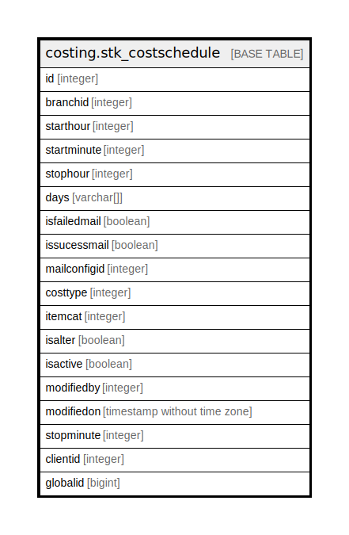

# costing.stk_costschedule

## Description

## Columns

| Name | Type | Default | Nullable | Children | Parents | Comment |
| ---- | ---- | ------- | -------- | -------- | ------- | ------- |
| id | integer | nextval('stk_costschedule_id'::regclass) | false |  |  |  |
| branchid | integer |  | false |  |  |  |
| starthour | integer |  | false |  |  |  |
| startminute | integer |  | false |  |  |  |
| stophour | integer |  | false |  |  |  |
| days | varchar[] |  | true |  |  |  |
| isfailedmail | boolean |  | false |  |  |  |
| issucessmail | boolean |  | false |  |  |  |
| mailconfigid | integer |  | false |  |  |  |
| costtype | integer | 0 | false |  |  |  |
| itemcat | integer | 0 | false |  |  |  |
| isalter | boolean | false | false |  |  |  |
| isactive | boolean |  | false |  |  |  |
| modifiedby | integer |  | true |  |  |  |
| modifiedon | timestamp without time zone | now() | true |  |  |  |
| stopminute | integer | 0 | false |  |  |  |
| clientid | integer |  | true |  |  |  |
| globalid | bigint | 0 | false |  |  | Globalnique Id for identify the schedule with format of ClientId+yyMMddHHmmss |

## Relations

---

> Generated by [tbls](https://github.com/k1LoW/tbls)
