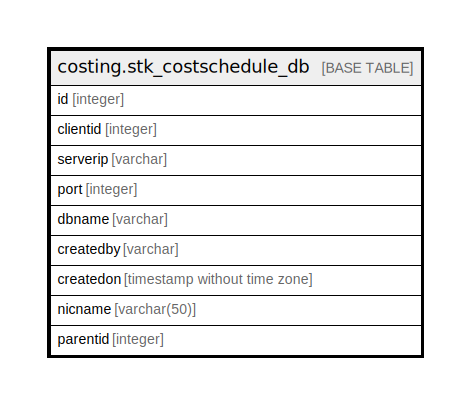

# costing.stk_costschedule_db

## Description

## Columns

| Name | Type | Default | Nullable | Children | Parents | Comment |
| ---- | ---- | ------- | -------- | -------- | ------- | ------- |
| id | integer |  | false |  |  |  |
| clientid | integer |  | false |  |  |  |
| serverip | varchar |  | false |  |  |  |
| port | integer |  | false |  |  |  |
| dbname | varchar |  | false |  |  |  |
| createdby | varchar |  | true |  |  |  |
| createdon | timestamp without time zone | now() | true |  |  |  |
| nicname | varchar(50) |  | true |  |  |  |
| parentid | integer | 0 | false |  |  | Its used to identify the parent DB which is connected to the service and this contains all other db schedules |

## Constraints

| Name | Type | Definition |
| ---- | ---- | ---------- |
| stk_costschedule_db_clientid | UNIQUE | UNIQUE (clientid) |
| stk_costschedule_db_id_key | UNIQUE | UNIQUE (id) |
| stk_costschedule_db_nicname | UNIQUE | UNIQUE (nicname) |

## Indexes

| Name | Definition |
| ---- | ---------- |
| stk_costschedule_db_clientid | CREATE UNIQUE INDEX stk_costschedule_db_clientid ON costing.stk_costschedule_db USING btree (clientid) |
| stk_costschedule_db_id_key | CREATE UNIQUE INDEX stk_costschedule_db_id_key ON costing.stk_costschedule_db USING btree (id) |
| stk_costschedule_db_nicname | CREATE UNIQUE INDEX stk_costschedule_db_nicname ON costing.stk_costschedule_db USING btree (nicname) |

## Relations

---

> Generated by [tbls](https://github.com/k1LoW/tbls)
