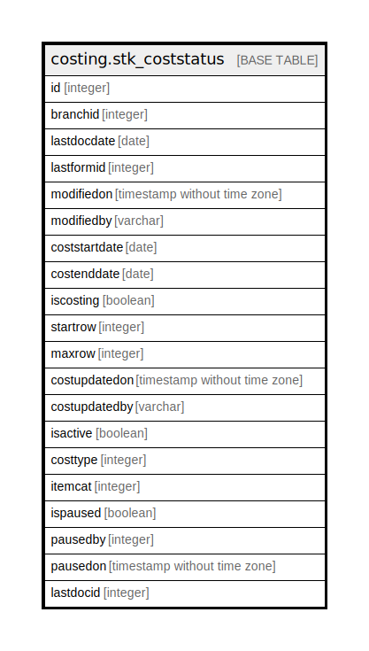

# costing.stk_coststatus

## Description

## Columns

| Name | Type | Default | Nullable | Children | Parents | Comment |
| ---- | ---- | ------- | -------- | -------- | ------- | ------- |
| id | integer | nextval('seq_stk_coststatus_id'::regclass) | false |  |  |  |
| branchid | integer |  | false |  |  |  |
| lastdocdate | date |  | false |  |  |  |
| lastformid | integer |  | false |  |  |  |
| modifiedon | timestamp without time zone | now() | false |  |  |  |
| modifiedby | varchar |  | true |  |  |  |
| coststartdate | date |  | true |  |  |  |
| costenddate | date |  | true |  |  |  |
| iscosting | boolean | false | false |  |  |  |
| startrow | integer | 0 | false |  |  |  |
| maxrow | integer | 0 | false |  |  |  |
| costupdatedon | timestamp without time zone | now() | true |  |  |  |
| costupdatedby | varchar |  | true |  |  |  |
| isactive | boolean | true | false |  |  |  |
| costtype | integer | 0 | false |  |  |  |
| itemcat | integer | 0 | false |  |  |  |
| ispaused | boolean | false | false |  |  |  |
| pausedby | integer |  | true |  |  |  |
| pausedon | timestamp without time zone |  | true |  |  |  |
| lastdocid | integer |  | true |  |  |  |

## Triggers

| Name | Definition |
| ---- | ---------- |
| tg_costing_stk_coststatus_log | CREATE TRIGGER tg_costing_stk_coststatus_log BEFORE INSERT OR DELETE OR UPDATE ON costing.stk_coststatus FOR EACH ROW EXECUTE FUNCTION tgr_updatecostdate_log() |

## Relations

---

> Generated by [tbls](https://github.com/k1LoW/tbls)
