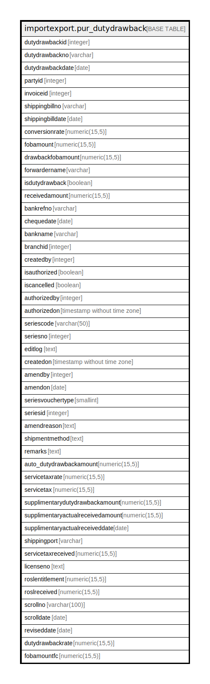

# importexport.pur_dutydrawback

## Description

## Columns

| Name | Type | Default | Nullable | Children | Parents | Comment |
| ---- | ---- | ------- | -------- | -------- | ------- | ------- |
| dutydrawbackid | integer | nextval('importexport.pur_dutydrawback_dutydrawbackid_seq'::regclass) | false |  |  |  |
| dutydrawbackno | varchar |  | true |  |  |  |
| dutydrawbackdate | date |  | true |  |  |  |
| partyid | integer |  | true |  |  |  |
| invoiceid | integer |  | true |  |  |  |
| shippingbillno | varchar |  | true |  |  |  |
| shippingbilldate | date |  | true |  |  |  |
| conversionrate | numeric(15,5) |  | true |  |  |  |
| fobamount | numeric(15,5) |  | true |  |  |  |
| drawbackfobamount | numeric(15,5) |  | true |  |  |  |
| forwardername | varchar |  | true |  |  |  |
| isdutydrawback | boolean | false | true |  |  |  |
| receivedamount | numeric(15,5) |  | true |  |  |  |
| bankrefno | varchar |  | true |  |  |  |
| chequedate | date |  | true |  |  |  |
| bankname | varchar |  | true |  |  |  |
| branchid | integer |  | true |  |  |  |
| createdby | integer |  | false |  |  |  |
| isauthorized | boolean | false | false |  |  |  |
| iscancelled | boolean | false | false |  |  |  |
| authorizedby | integer |  | true |  |  |  |
| authorizedon | timestamp without time zone |  | true |  |  |  |
| seriescode | varchar(50) |  | true |  |  |  |
| seriesno | integer |  | true |  |  |  |
| editlog | text |  | true |  |  |  |
| createdon | timestamp without time zone | now() | true |  |  |  |
| amendby | integer |  | true |  |  |  |
| amendon | date |  | true |  |  |  |
| seriesvouchertype | smallint | 0 | true |  |  |  |
| seriesid | integer |  | true |  |  |  |
| amendreason | text |  | true |  |  |  |
| shipmentmethod | text |  | true |  |  |  |
| remarks | text |  | true |  |  |  |
| auto_dutydrawbackamount | numeric(15,5) |  | true |  |  |  |
| servicetaxrate | numeric(15,5) |  | true |  |  |  |
| servicetax | numeric(15,5) |  | true |  |  |  |
| supplimentarydutydrawbackamount | numeric(15,5) |  | true |  |  |  |
| supplimentaryactualreceivedamount | numeric(15,5) |  | true |  |  |  |
| supplimentaryactualreceiveddate | date |  | true |  |  |  |
| shippingport | varchar |  | true |  |  |  |
| servicetaxreceived | numeric(15,5) |  | true |  |  |  |
| licenseno | text |  | true |  |  |  |
| roslentitlement | numeric(15,5) |  | true |  |  |  |
| roslreceived | numeric(15,5) |  | true |  |  |  |
| scrollno | varchar(100) |  | true |  |  |  |
| scrolldate | date |  | true |  |  |  |
| reviseddate | date |  | true |  |  |  |
| dutydrawbackrate | numeric(15,5) |  | true |  |  |  |
| fobamountfc | numeric(15,5) |  | true |  |  |  |

## Constraints

| Name | Type | Definition |
| ---- | ---- | ---------- |
| pur_dutydrawback_pkey | PRIMARY KEY | PRIMARY KEY (dutydrawbackid) |

## Indexes

| Name | Definition |
| ---- | ---------- |
| pur_dutydrawback_pkey | CREATE UNIQUE INDEX pur_dutydrawback_pkey ON importexport.pur_dutydrawback USING btree (dutydrawbackid) |

## Relations

---

> Generated by [tbls](https://github.com/k1LoW/tbls)
