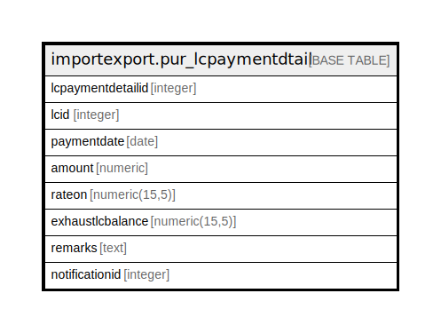

# importexport.pur_lcpaymentdtail

## Description

## Columns

| Name | Type | Default | Nullable | Children | Parents | Comment |
| ---- | ---- | ------- | -------- | -------- | ------- | ------- |
| lcpaymentdetailid | integer | nextval('importexport.pur_lcpaymentdtail_lcpaymentdetailid_seq'::regclass) | false |  |  |  |
| lcid | integer |  | false |  |  |  |
| paymentdate | date |  | true |  |  |  |
| amount | numeric |  | true |  |  |  |
| rateon | numeric(15,5) |  | true |  |  |  |
| exhaustlcbalance | numeric(15,5) |  | true |  |  |  |
| remarks | text |  | true |  |  |  |
| notificationid | integer |  | true |  |  |  |

## Constraints

| Name | Type | Definition |
| ---- | ---- | ---------- |
| pur_lcpaymentdtail_pkey | PRIMARY KEY | PRIMARY KEY (lcpaymentdetailid) |

## Indexes

| Name | Definition |
| ---- | ---------- |
| pur_lcpaymentdtail_pkey | CREATE UNIQUE INDEX pur_lcpaymentdtail_pkey ON importexport.pur_lcpaymentdtail USING btree (lcpaymentdetailid) |

## Relations

---

> Generated by [tbls](https://github.com/k1LoW/tbls)
