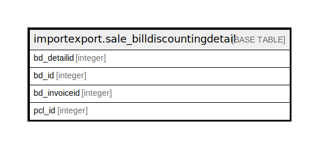

# importexport.sale_billdiscountingdetail

## Description

## Columns

| Name | Type | Default | Nullable | Children | Parents | Comment |
| ---- | ---- | ------- | -------- | -------- | ------- | ------- |
| bd_detailid | integer | nextval('importexport.sale_billdiscountingdetail_bd_detailid_seq'::regclass) | false |  |  |  |
| bd_id | integer |  | false |  |  |  |
| bd_invoiceid | integer |  | true |  |  |  |
| pcl_id | integer |  | true |  |  |  |

## Constraints

| Name | Type | Definition |
| ---- | ---- | ---------- |
| sale_billdiscountingdetail_pkey | PRIMARY KEY | PRIMARY KEY (bd_detailid) |

## Indexes

| Name | Definition |
| ---- | ---------- |
| sale_billdiscountingdetail_pkey | CREATE UNIQUE INDEX sale_billdiscountingdetail_pkey ON importexport.sale_billdiscountingdetail USING btree (bd_detailid) |

## Relations

---

> Generated by [tbls](https://github.com/k1LoW/tbls)
