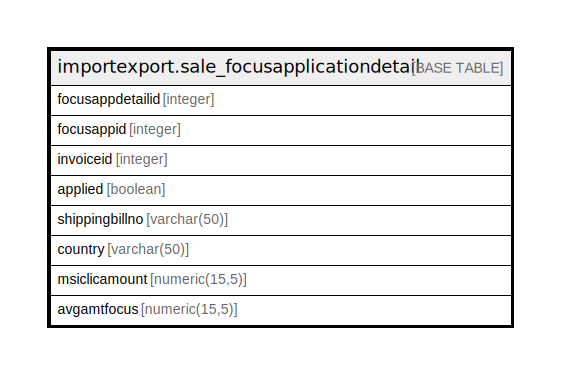

# importexport.sale_focusapplicationdetail

## Description

## Columns

| Name | Type | Default | Nullable | Children | Parents | Comment |
| ---- | ---- | ------- | -------- | -------- | ------- | ------- |
| focusappdetailid | integer | nextval('importexport.sale_focusapplicationdetail_focusappdetailid_seq'::regclass) | false |  |  |  |
| focusappid | integer |  | true |  |  |  |
| invoiceid | integer |  | true |  |  |  |
| applied | boolean | false | true |  |  |  |
| shippingbillno | varchar(50) |  | true |  |  |  |
| country | varchar(50) |  | true |  |  |  |
| msiclicamount | numeric(15,5) |  | true |  |  |  |
| avgamtfocus | numeric(15,5) |  | true |  |  |  |

## Constraints

| Name | Type | Definition |
| ---- | ---- | ---------- |
| sale_focusapplicationdetail_pkey | PRIMARY KEY | PRIMARY KEY (focusappdetailid) |

## Indexes

| Name | Definition |
| ---- | ---------- |
| sale_focusapplicationdetail_pkey | CREATE UNIQUE INDEX sale_focusapplicationdetail_pkey ON importexport.sale_focusapplicationdetail USING btree (focusappdetailid) |

## Relations

---

> Generated by [tbls](https://github.com/k1LoW/tbls)
