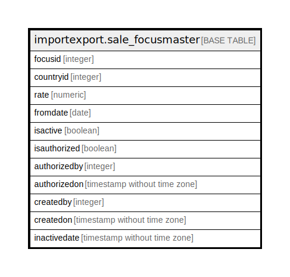

# importexport.sale_focusmaster

## Description

## Columns

| Name | Type | Default | Nullable | Children | Parents | Comment |
| ---- | ---- | ------- | -------- | -------- | ------- | ------- |
| focusid | integer | nextval('importexport.sale_focusmaster_focusid_seq'::regclass) | false |  |  |  |
| countryid | integer |  | true |  |  |  |
| rate | numeric |  | true |  |  |  |
| fromdate | date |  | true |  |  |  |
| isactive | boolean | false | true |  |  |  |
| isauthorized | boolean |  | true |  |  |  |
| authorizedby | integer |  | true |  |  |  |
| authorizedon | timestamp without time zone |  | true |  |  |  |
| createdby | integer |  | true |  |  |  |
| createdon | timestamp without time zone |  | true |  |  |  |
| inactivedate | timestamp without time zone |  | true |  |  |  |

## Constraints

| Name | Type | Definition |
| ---- | ---- | ---------- |
| sale_focusmaster_pkey | PRIMARY KEY | PRIMARY KEY (focusid) |

## Indexes

| Name | Definition |
| ---- | ---------- |
| sale_focusmaster_pkey | CREATE UNIQUE INDEX sale_focusmaster_pkey ON importexport.sale_focusmaster USING btree (focusid) |

## Relations

---

> Generated by [tbls](https://github.com/k1LoW/tbls)
