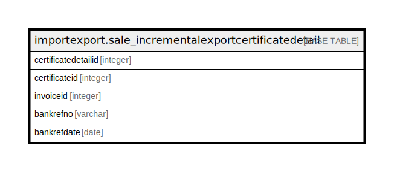

# importexport.sale_incrementalexportcertificatedetail

## Description

## Columns

| Name | Type | Default | Nullable | Children | Parents | Comment |
| ---- | ---- | ------- | -------- | -------- | ------- | ------- |
| certificatedetailid | integer | nextval('importexport.sale_incrementalexportcertificatedetail_certificatedetailid_seq'::regclass) | false |  |  |  |
| certificateid | integer |  | true |  |  |  |
| invoiceid | integer |  | true |  |  |  |
| bankrefno | varchar |  | true |  |  |  |
| bankrefdate | date |  | true |  |  |  |

## Constraints

| Name | Type | Definition |
| ---- | ---- | ---------- |
| sale_incrementalexportcertificatedetail_pkey | PRIMARY KEY | PRIMARY KEY (certificatedetailid) |

## Indexes

| Name | Definition |
| ---- | ---------- |
| sale_incrementalexportcertificatedetail_pkey | CREATE UNIQUE INDEX sale_incrementalexportcertificatedetail_pkey ON importexport.sale_incrementalexportcertificatedetail USING btree (certificatedetailid) |

## Relations

---

> Generated by [tbls](https://github.com/k1LoW/tbls)
