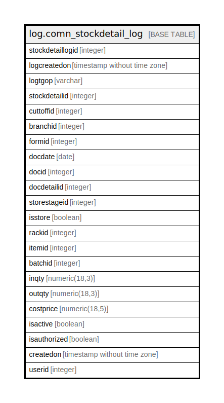

# log.comn_stockdetail_log

## Description

History of Comn_StockDetail table(meta data).

## Columns

| Name | Type | Default | Nullable | Children | Parents | Comment |
| ---- | ---- | ------- | -------- | -------- | ------- | ------- |
| stockdetaillogid | integer | nextval('log.seq_stockdetaillogid'::regclass) | true |  |  |  |
| logcreatedon | timestamp without time zone | now() | true |  |  |  |
| logtgop | varchar |  | true |  |  |  |
| stockdetailid | integer |  | true |  |  |  |
| cuttoffid | integer |  | true |  |  |  |
| branchid | integer |  | true |  |  |  |
| formid | integer |  | true |  |  |  |
| docdate | date |  | true |  |  |  |
| docid | integer |  | true |  |  |  |
| docdetailid | integer |  | true |  |  |  |
| storestageid | integer |  | true |  |  |  |
| isstore | boolean |  | true |  |  |  |
| rackid | integer |  | true |  |  |  |
| itemid | integer |  | true |  |  |  |
| batchid | integer |  | true |  |  |  |
| inqty | numeric(18,3) |  | true |  |  |  |
| outqty | numeric(18,3) |  | true |  |  |  |
| costprice | numeric(18,5) |  | true |  |  |  |
| isactive | boolean |  | true |  |  |  |
| isauthorized | boolean |  | true |  |  |  |
| createdon | timestamp without time zone |  | true |  |  |  |
| userid | integer |  | true |  |  |  |

## Relations

---

> Generated by [tbls](https://github.com/k1LoW/tbls)
