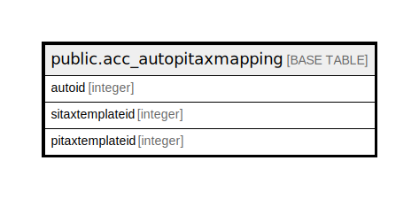

# public.acc_autopitaxmapping

## Description

## Columns

| Name | Type | Default | Nullable | Children | Parents | Comment |
| ---- | ---- | ------- | -------- | -------- | ------- | ------- |
| autoid | integer | nextval('acc_autopitaxmapping_autoid_seq'::regclass) | false |  |  |  |
| sitaxtemplateid | integer |  | true |  |  |  |
| pitaxtemplateid | integer |  | true |  |  |  |

## Constraints

| Name | Type | Definition |
| ---- | ---- | ---------- |
| acc_autopitaxmapping_pkey | PRIMARY KEY | PRIMARY KEY (autoid) |

## Indexes

| Name | Definition |
| ---- | ---------- |
| acc_autopitaxmapping_pkey | CREATE UNIQUE INDEX acc_autopitaxmapping_pkey ON public.acc_autopitaxmapping USING btree (autoid) |

## Relations

---

> Generated by [tbls](https://github.com/k1LoW/tbls)
