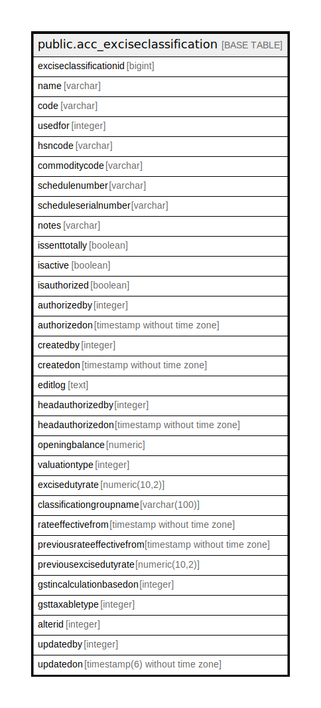

# public.acc_exciseclassification

## Description

## Columns

| Name | Type | Default | Nullable | Children | Parents | Comment |
| ---- | ---- | ------- | -------- | -------- | ------- | ------- |
| exciseclassificationid | bigint | nextval('acc_exciseclassification_exciseclassificationid_seq'::regclass) | false |  |  |  |
| name | varchar |  | false |  |  |  |
| code | varchar |  | true |  |  |  |
| usedfor | integer |  | false |  |  |  |
| hsncode | varchar |  | true |  |  |  |
| commoditycode | varchar |  | true |  |  |  |
| schedulenumber | varchar |  | true |  |  |  |
| scheduleserialnumber | varchar |  | true |  |  |  |
| notes | varchar |  | true |  |  |  |
| issenttotally | boolean | false | true |  |  |  |
| isactive | boolean | true | true |  |  |  |
| isauthorized | boolean | false | false |  |  |  |
| authorizedby | integer |  | true |  |  |  |
| authorizedon | timestamp without time zone |  | true |  |  |  |
| createdby | integer |  | true |  |  |  |
| createdon | timestamp without time zone | now() | true |  |  |  |
| editlog | text |  | true |  |  |  |
| headauthorizedby | integer |  | true |  |  |  |
| headauthorizedon | timestamp without time zone |  | true |  |  |  |
| openingbalance | numeric | 0 | true |  |  |  |
| valuationtype | integer | 2 | true |  |  | Get Value From setting master and setting value master setting id = 62 |
| excisedutyrate | numeric(10,2) |  | true |  |  |  |
| classificationgroupname | varchar(100) |  | true |  |  |  |
| rateeffectivefrom | timestamp without time zone |  | true |  |  |  |
| previousrateeffectivefrom | timestamp without time zone |  | true |  |  |  |
| previousexcisedutyrate | numeric(10,2) |  | true |  |  |  |
| gstincalculationbasedon | integer |  | true |  |  |  |
| gsttaxabletype | integer |  | true |  |  |  |
| alterid | integer |  | true |  |  |  |
| updatedby | integer |  | true |  |  |  |
| updatedon | timestamp(6) without time zone | NULL::timestamp without time zone | true |  |  |  |

## Constraints

| Name | Type | Definition |
| ---- | ---- | ---------- |
| acc_exciseclassification_name_key | UNIQUE | UNIQUE (name) |
| acc_exciseclassification_pkey | PRIMARY KEY | PRIMARY KEY (exciseclassificationid) |

## Indexes

| Name | Definition |
| ---- | ---------- |
| acc_exciseclassification_name_key | CREATE UNIQUE INDEX acc_exciseclassification_name_key ON public.acc_exciseclassification USING btree (name) |
| acc_exciseclassification_pkey | CREATE UNIQUE INDEX acc_exciseclassification_pkey ON public.acc_exciseclassification USING btree (exciseclassificationid) |

## Triggers

| Name | Definition |
| ---- | ---------- |
| acc_exciseclassification_log_entry | CREATE TRIGGER acc_exciseclassification_log_entry AFTER UPDATE ON public.acc_exciseclassification FOR EACH ROW EXECUTE FUNCTION acc_exciseclassification_log_entry() |
| update_alter_id | CREATE TRIGGER update_alter_id AFTER INSERT OR UPDATE ON public.acc_exciseclassification FOR EACH ROW EXECUTE FUNCTION updatealterid() |

## Relations

---

> Generated by [tbls](https://github.com/k1LoW/tbls)
