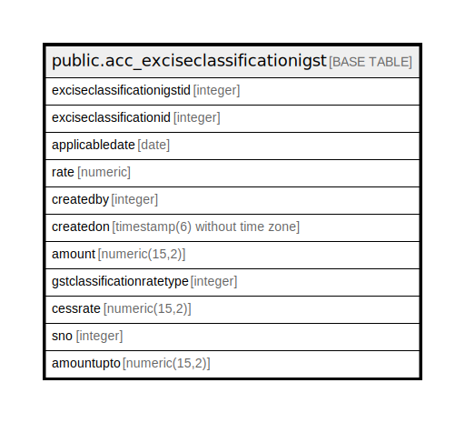

# public.acc_exciseclassificationigst

## Description

## Columns

| Name | Type | Default | Nullable | Children | Parents | Comment |
| ---- | ---- | ------- | -------- | -------- | ------- | ------- |
| exciseclassificationigstid | integer | nextval('acc_exciseclassificationigst_exciseclassificationigstid_seq'::regclass) | false |  |  |  |
| exciseclassificationid | integer |  | true |  |  |  |
| applicabledate | date |  | true |  |  |  |
| rate | numeric |  | true |  |  |  |
| createdby | integer |  | true |  |  |  |
| createdon | timestamp(6) without time zone | now() | true |  |  |  |
| amount | numeric(15,2) | 0 | false |  |  |  |
| gstclassificationratetype | integer | 0 | false |  |  |  |
| cessrate | numeric(15,2) | 0 | false |  |  |  |
| sno | integer |  | true |  |  |  |
| amountupto | numeric(15,2) | 0 | true |  |  |  |

## Constraints

| Name | Type | Definition |
| ---- | ---- | ---------- |
| acc_exciseclassificationigst_pkey | PRIMARY KEY | PRIMARY KEY (exciseclassificationigstid) |

## Indexes

| Name | Definition |
| ---- | ---------- |
| acc_exciseclassificationigst_pkey | CREATE UNIQUE INDEX acc_exciseclassificationigst_pkey ON public.acc_exciseclassificationigst USING btree (exciseclassificationigstid) |

## Triggers

| Name | Definition |
| ---- | ---------- |
| acc_exciseclassification_log_entry | CREATE TRIGGER acc_exciseclassification_log_entry AFTER UPDATE ON public.acc_exciseclassificationigst FOR EACH ROW EXECUTE FUNCTION acc_exciseclassification_log_entry() |

## Relations

---

> Generated by [tbls](https://github.com/k1LoW/tbls)
