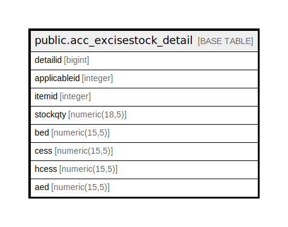

# public.acc_excisestock_detail

## Description

## Columns

| Name | Type | Default | Nullable | Children | Parents | Comment |
| ---- | ---- | ------- | -------- | -------- | ------- | ------- |
| detailid | bigint | nextval('acc_excisestock_detail_detailid_seq'::regclass) | false |  |  |  |
| applicableid | integer |  | true |  |  |  |
| itemid | integer |  | true |  |  |  |
| stockqty | numeric(18,5) |  | true |  |  |  |
| bed | numeric(15,5) |  | true |  |  |  |
| cess | numeric(15,5) |  | true |  |  |  |
| hcess | numeric(15,5) |  | true |  |  |  |
| aed | numeric(15,5) |  | true |  |  |  |

## Constraints

| Name | Type | Definition |
| ---- | ---- | ---------- |
| acc_excisestock_detail_pkey | PRIMARY KEY | PRIMARY KEY (detailid) |

## Indexes

| Name | Definition |
| ---- | ---------- |
| acc_excisestock_detail_pkey | CREATE UNIQUE INDEX acc_excisestock_detail_pkey ON public.acc_excisestock_detail USING btree (detailid) |

## Relations

---

> Generated by [tbls](https://github.com/k1LoW/tbls)
