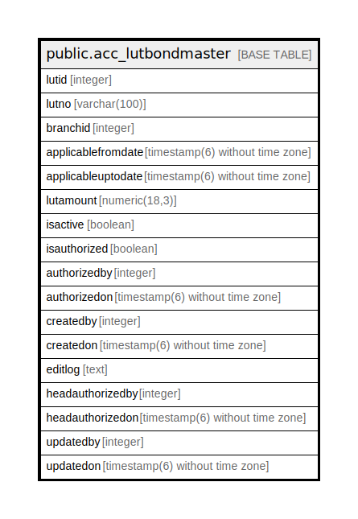

# public.acc_lutbondmaster

## Description

## Columns

| Name | Type | Default | Nullable | Children | Parents | Comment |
| ---- | ---- | ------- | -------- | -------- | ------- | ------- |
| lutid | integer | nextval('acc_lutbondmaster_lutid_seq'::regclass) | false |  |  |  |
| lutno | varchar(100) |  | true |  |  |  |
| branchid | integer |  | true |  |  |  |
| applicablefromdate | timestamp(6) without time zone |  | true |  |  |  |
| applicableuptodate | timestamp(6) without time zone |  | true |  |  |  |
| lutamount | numeric(18,3) | 0 | true |  |  |  |
| isactive | boolean | false | true |  |  |  |
| isauthorized | boolean | false | true |  |  |  |
| authorizedby | integer |  | true |  |  |  |
| authorizedon | timestamp(6) without time zone |  | true |  |  |  |
| createdby | integer |  | true |  |  |  |
| createdon | timestamp(6) without time zone | now() | true |  |  |  |
| editlog | text |  | true |  |  |  |
| headauthorizedby | integer |  | true |  |  |  |
| headauthorizedon | timestamp(6) without time zone |  | true |  |  |  |
| updatedby | integer |  | true |  |  |  |
| updatedon | timestamp(6) without time zone | NULL::timestamp without time zone | true |  |  |  |

## Constraints

| Name | Type | Definition |
| ---- | ---- | ---------- |
| acc_lutbondmaster_lutno_key | UNIQUE | UNIQUE (lutno) |
| acc_lutbondmaster_pkey | PRIMARY KEY | PRIMARY KEY (lutid) |

## Indexes

| Name | Definition |
| ---- | ---------- |
| acc_lutbondmaster_lutno_key | CREATE UNIQUE INDEX acc_lutbondmaster_lutno_key ON public.acc_lutbondmaster USING btree (lutno) |
| acc_lutbondmaster_pkey | CREATE UNIQUE INDEX acc_lutbondmaster_pkey ON public.acc_lutbondmaster USING btree (lutid) |

## Relations

---

> Generated by [tbls](https://github.com/k1LoW/tbls)
