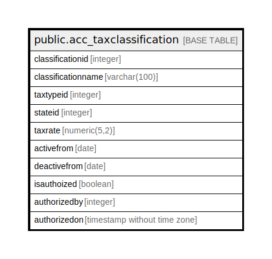

# public.acc_taxclassification

## Description

## Columns

| Name | Type | Default | Nullable | Children | Parents | Comment |
| ---- | ---- | ------- | -------- | -------- | ------- | ------- |
| classificationid | integer | nextval('acc_taxclassification_classificationid_seq'::regclass) | false |  |  |  |
| classificationname | varchar(100) |  | true |  |  |  |
| taxtypeid | integer |  | true |  |  |  |
| stateid | integer |  | true |  |  |  |
| taxrate | numeric(5,2) | 0 | true |  |  |  |
| activefrom | date |  | true |  |  |  |
| deactivefrom | date |  | true |  |  |  |
| isauthoized | boolean | false | true |  |  |  |
| authorizedby | integer |  | true |  |  |  |
| authorizedon | timestamp without time zone |  | true |  |  |  |

## Constraints

| Name | Type | Definition |
| ---- | ---- | ---------- |
| taxclassification_classificationname_key | UNIQUE | UNIQUE (classificationname) |
| taxclassification_pkey | PRIMARY KEY | PRIMARY KEY (classificationid) |

## Indexes

| Name | Definition |
| ---- | ---------- |
| taxclassification_classificationname_key | CREATE UNIQUE INDEX taxclassification_classificationname_key ON public.acc_taxclassification USING btree (classificationname) |
| taxclassification_pkey | CREATE UNIQUE INDEX taxclassification_pkey ON public.acc_taxclassification USING btree (classificationid) |

## Relations

---

> Generated by [tbls](https://github.com/k1LoW/tbls)
