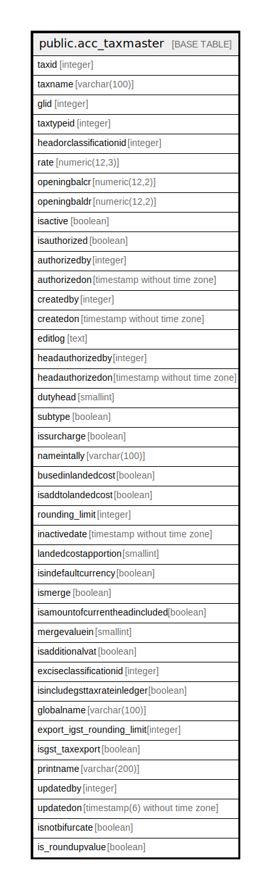

# public.acc_taxmaster

## Description

## Columns

| Name | Type | Default | Nullable | Children | Parents | Comment |
| ---- | ---- | ------- | -------- | -------- | ------- | ------- |
| taxid | integer | nextval('acc_taxmaster_taxid_seq'::regclass) | false |  |  |  |
| taxname | varchar(100) |  | true |  |  |  |
| glid | integer |  | true |  |  |  |
| taxtypeid | integer |  | true |  |  |  |
| headorclassificationid | integer |  | true |  |  |  |
| rate | numeric(12,3) | 0 | true |  |  |  |
| openingbalcr | numeric(12,2) | 0 | true |  |  |  |
| openingbaldr | numeric(12,2) | 0 | true |  |  |  |
| isactive | boolean | false | true |  |  |  |
| isauthorized | boolean | false | true |  |  |  |
| authorizedby | integer |  | true |  |  |  |
| authorizedon | timestamp without time zone |  | true |  |  |  |
| createdby | integer |  | true |  |  |  |
| createdon | timestamp without time zone | now() | true |  |  |  |
| editlog | text |  | true |  |  |  |
| headauthorizedby | integer |  | true |  |  |  |
| headauthorizedon | timestamp without time zone |  | true |  |  |  |
| dutyhead | smallint |  | true |  |  |  |
| subtype | boolean |  | true |  |  |  |
| issurcharge | boolean | false | true |  |  |  |
| nameintally | varchar(100) |  | true |  |  |  |
| busedinlandedcost | boolean | false | true |  |  |  |
| isaddtolandedcost | boolean | false | true |  |  |  |
| rounding_limit | integer | 2 | true |  |  |  |
| inactivedate | timestamp without time zone |  | true |  |  |  |
| landedcostapportion | smallint | '-1'::integer | true |  |  |  |
| isindefaultcurrency | boolean | true | true |  |  |  |
| ismerge | boolean |  | true |  |  |  |
| isamountofcurrentheadincluded | boolean | true | true |  |  |  |
| mergevaluein | smallint | 0 | true |  |  |  |
| isadditionalvat | boolean | false | true |  |  |  |
| exciseclassificationid | integer |  | true |  |  |  |
| isincludegsttaxrateinledger | boolean | false | true |  |  |  |
| globalname | varchar(100) | ''::character varying | true |  |  |  |
| export_igst_rounding_limit | integer | 2 | true |  |  |  |
| isgst_taxexport | boolean | false | true |  |  |  |
| printname | varchar(200) | NULL::character varying | true |  |  |  |
| updatedby | integer |  | true |  |  |  |
| updatedon | timestamp(6) without time zone | NULL::timestamp without time zone | true |  |  |  |
| isnotbifurcate | boolean | false | false |  |  | This column specify this tax head allow to bifurcate values to item level or not.it can be negative or positive values! |
| is_roundupvalue | boolean | false | true |  |  |  |

## Constraints

| Name | Type | Definition |
| ---- | ---- | ---------- |
| taxmaster_pkey | PRIMARY KEY | PRIMARY KEY (taxid) |
| taxmaster_taxname_key | UNIQUE | UNIQUE (taxname) |

## Indexes

| Name | Definition |
| ---- | ---------- |
| taxmaster_pkey | CREATE UNIQUE INDEX taxmaster_pkey ON public.acc_taxmaster USING btree (taxid) |
| taxmaster_taxname_key | CREATE UNIQUE INDEX taxmaster_taxname_key ON public.acc_taxmaster USING btree (taxname) |
| Index_TaxMast_TaxIDAct | CREATE INDEX "Index_TaxMast_TaxIDAct" ON public.acc_taxmaster USING btree (taxid) WHERE (isactive = true) |

## Relations

---

> Generated by [tbls](https://github.com/k1LoW/tbls)
