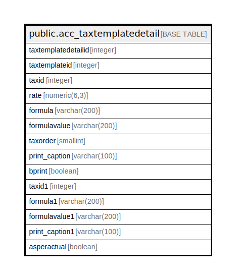

# public.acc_taxtemplatedetail

## Description

## Columns

| Name | Type | Default | Nullable | Children | Parents | Comment |
| ---- | ---- | ------- | -------- | -------- | ------- | ------- |
| taxtemplatedetailid | integer | nextval('acc_taxtemplatedetail_taxtemplatedetailid_seq'::regclass) | false |  |  |  |
| taxtemplateid | integer |  | true |  |  |  |
| taxid | integer |  | true |  |  |  |
| rate | numeric(6,3) |  | true |  |  |  |
| formula | varchar(200) |  | true |  |  |  |
| formulavalue | varchar(200) |  | true |  |  |  |
| taxorder | smallint |  | true |  |  |  |
| print_caption | varchar(100) | ''::character varying | true |  |  |  |
| bprint | boolean | true | true |  |  |  |
| taxid1 | integer |  | true |  |  |  |
| formula1 | varchar(200) |  | true |  |  |  |
| formulavalue1 | varchar(200) |  | true |  |  |  |
| print_caption1 | varchar(100) |  | true |  |  |  |
| asperactual | boolean | false | true |  |  |  |

## Constraints

| Name | Type | Definition |
| ---- | ---- | ---------- |
| UnoqueTax | UNIQUE | UNIQUE (taxtemplateid, taxid) |
| taxtemplatedetail_pkey | PRIMARY KEY | PRIMARY KEY (taxtemplatedetailid) |

## Indexes

| Name | Definition |
| ---- | ---------- |
| UnoqueTax | CREATE UNIQUE INDEX "UnoqueTax" ON public.acc_taxtemplatedetail USING btree (taxtemplateid, taxid) |
| taxtemplatedetail_pkey | CREATE UNIQUE INDEX taxtemplatedetail_pkey ON public.acc_taxtemplatedetail USING btree (taxtemplatedetailid) |

## Relations

---

> Generated by [tbls](https://github.com/k1LoW/tbls)
