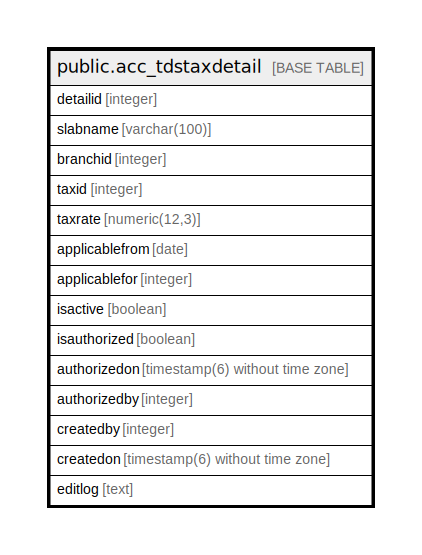

# public.acc_tdstaxdetail

## Description

## Columns

| Name | Type | Default | Nullable | Children | Parents | Comment |
| ---- | ---- | ------- | -------- | -------- | ------- | ------- |
| detailid | integer | nextval('acc_tdstaxdetail_detailid_seq'::regclass) | false |  |  |  |
| slabname | varchar(100) |  | true |  |  |  |
| branchid | integer |  | true |  |  |  |
| taxid | integer |  | true |  |  |  |
| taxrate | numeric(12,3) | 0 | true |  |  |  |
| applicablefrom | date |  | true |  |  |  |
| applicablefor | integer |  | true |  |  |  |
| isactive | boolean | true | false |  |  |  |
| isauthorized | boolean | false | false |  |  |  |
| authorizedon | timestamp(6) without time zone |  | true |  |  |  |
| authorizedby | integer |  | true |  |  |  |
| createdby | integer |  | true |  |  |  |
| createdon | timestamp(6) without time zone | now() | true |  |  |  |
| editlog | text |  | true |  |  |  |

## Constraints

| Name | Type | Definition |
| ---- | ---- | ---------- |
| acc_tcstaxdetail_pley | PRIMARY KEY | PRIMARY KEY (detailid) |

## Indexes

| Name | Definition |
| ---- | ---------- |
| acc_tcstaxdetail_pley | CREATE UNIQUE INDEX acc_tcstaxdetail_pley ON public.acc_tdstaxdetail USING btree (detailid) |

## Relations

---

> Generated by [tbls](https://github.com/k1LoW/tbls)
