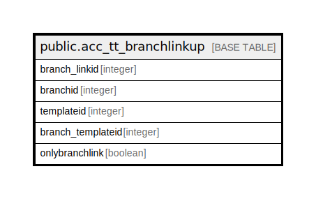

# public.acc_tt_branchlinkup

## Description

## Columns

| Name | Type | Default | Nullable | Children | Parents | Comment |
| ---- | ---- | ------- | -------- | -------- | ------- | ------- |
| branch_linkid | integer | nextval('acc_tt_branchlinkup_branch_linkid_seq'::regclass) | false |  |  |  |
| branchid | integer |  | true |  |  |  |
| templateid | integer |  | true |  |  |  |
| branch_templateid | integer |  | true |  |  |  |
| onlybranchlink | boolean | false | true |  |  |  |

## Constraints

| Name | Type | Definition |
| ---- | ---- | ---------- |
| acc_tt_branchlinkup_pkey | PRIMARY KEY | PRIMARY KEY (branch_linkid) |

## Indexes

| Name | Definition |
| ---- | ---------- |
| acc_tt_branchlinkup_pkey | CREATE UNIQUE INDEX acc_tt_branchlinkup_pkey ON public.acc_tt_branchlinkup USING btree (branch_linkid) |

## Relations

---

> Generated by [tbls](https://github.com/k1LoW/tbls)
