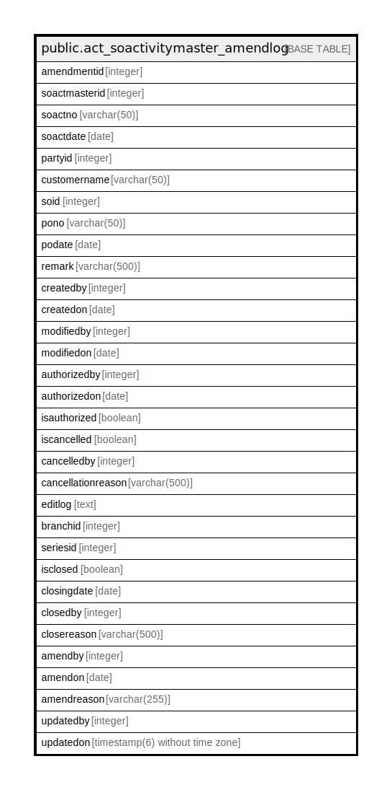

# public.act_soactivitymaster_amendlog

## Description

## Columns

| Name | Type | Default | Nullable | Children | Parents | Comment |
| ---- | ---- | ------- | -------- | -------- | ------- | ------- |
| amendmentid | integer | nextval('act_soactivitymaster_amendlog_amendmentid_seq'::regclass) | false |  |  |  |
| soactmasterid | integer |  | true |  |  |  |
| soactno | varchar(50) |  | true |  |  |  |
| soactdate | date |  | true |  |  |  |
| partyid | integer |  | true |  |  |  |
| customername | varchar(50) |  | true |  |  |  |
| soid | integer |  | true |  |  |  |
| pono | varchar(50) |  | true |  |  |  |
| podate | date |  | true |  |  |  |
| remark | varchar(500) |  | true |  |  |  |
| createdby | integer |  | true |  |  |  |
| createdon | date |  | true |  |  |  |
| modifiedby | integer |  | true |  |  |  |
| modifiedon | date |  | true |  |  |  |
| authorizedby | integer |  | true |  |  |  |
| authorizedon | date |  | true |  |  |  |
| isauthorized | boolean |  | true |  |  |  |
| iscancelled | boolean |  | true |  |  |  |
| cancelledby | integer |  | true |  |  |  |
| cancellationreason | varchar(500) |  | true |  |  |  |
| editlog | text |  | true |  |  |  |
| branchid | integer |  | true |  |  |  |
| seriesid | integer |  | true |  |  |  |
| isclosed | boolean |  | true |  |  |  |
| closingdate | date |  | true |  |  |  |
| closedby | integer |  | true |  |  |  |
| closereason | varchar(500) |  | true |  |  |  |
| amendby | integer | 0 | true |  |  |  |
| amendon | date |  | true |  |  |  |
| amendreason | varchar(255) | ''::character varying | true |  |  |  |
| updatedby | integer |  | true |  |  |  |
| updatedon | timestamp(6) without time zone | NULL::timestamp without time zone | true |  |  |  |

## Relations

---

> Generated by [tbls](https://github.com/k1LoW/tbls)
