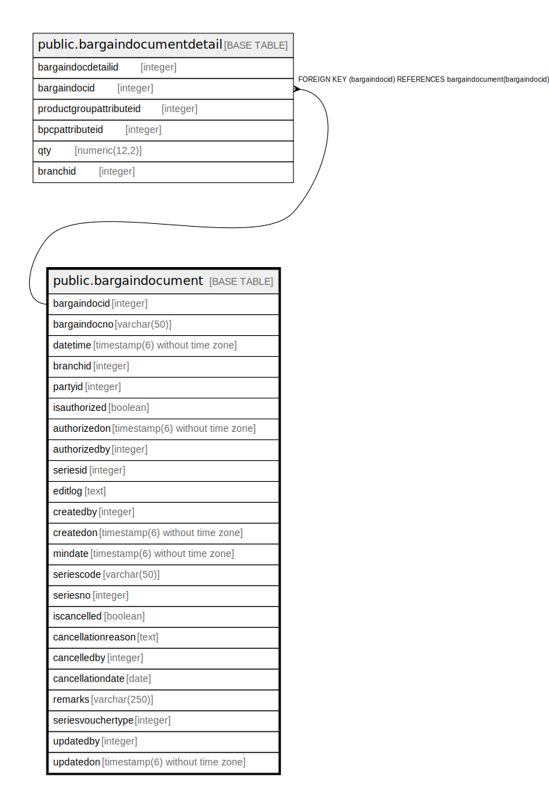

# public.bargaindocument

## Description

## Columns

| Name | Type | Default | Nullable | Children | Parents | Comment |
| ---- | ---- | ------- | -------- | -------- | ------- | ------- |
| bargaindocid | integer | nextval('bargaindocument_bargaindocid_seq'::regclass) | false | [public.bargaindocumentdetail](public.bargaindocumentdetail.md) |  |  |
| bargaindocno | varchar(50) |  | true |  |  |  |
| datetime | timestamp(6) without time zone | now() | true |  |  |  |
| branchid | integer |  | true |  |  |  |
| partyid | integer |  | true |  |  |  |
| isauthorized | boolean | false | false |  |  |  |
| authorizedon | timestamp(6) without time zone |  | true |  |  |  |
| authorizedby | integer |  | true |  |  |  |
| seriesid | integer |  | true |  |  |  |
| editlog | text |  | true |  |  |  |
| createdby | integer |  | true |  |  |  |
| createdon | timestamp(6) without time zone | now() | true |  |  |  |
| mindate | timestamp(6) without time zone |  | true |  |  |  |
| seriescode | varchar(50) |  | true |  |  |  |
| seriesno | integer |  | true |  |  |  |
| iscancelled | boolean | false | true |  |  |  |
| cancellationreason | text |  | true |  |  |  |
| cancelledby | integer |  | true |  |  |  |
| cancellationdate | date |  | true |  |  |  |
| remarks | varchar(250) | NULL::character varying | true |  |  |  |
| seriesvouchertype | integer |  | true |  |  |  |
| updatedby | integer |  | true |  |  |  |
| updatedon | timestamp(6) without time zone | NULL::timestamp without time zone | true |  |  |  |

## Constraints

| Name | Type | Definition |
| ---- | ---- | ---------- |
| bargaindocument_pkey | PRIMARY KEY | PRIMARY KEY (bargaindocid) |

## Indexes

| Name | Definition |
| ---- | ---------- |
| bargaindocument_pkey | CREATE UNIQUE INDEX bargaindocument_pkey ON public.bargaindocument USING btree (bargaindocid) |

## Relations

---

> Generated by [tbls](https://github.com/k1LoW/tbls)
