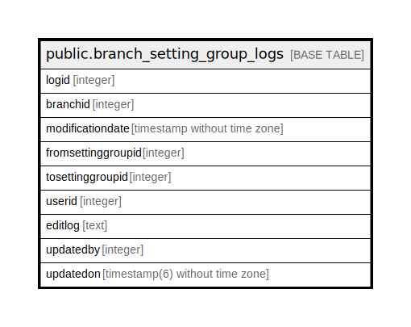

# public.branch_setting_group_logs

## Description

## Columns

| Name | Type | Default | Nullable | Children | Parents | Comment |
| ---- | ---- | ------- | -------- | -------- | ------- | ------- |
| logid | integer | nextval('branch_setting_group_logs_logid_seq'::regclass) | false |  |  |  |
| branchid | integer |  | false |  |  |  |
| modificationdate | timestamp without time zone |  | true |  |  |  |
| fromsettinggroupid | integer |  | true |  |  |  |
| tosettinggroupid | integer |  | true |  |  |  |
| userid | integer |  | true |  |  |  |
| editlog | text |  | true |  |  |  |
| updatedby | integer |  | true |  |  |  |
| updatedon | timestamp(6) without time zone | NULL::timestamp without time zone | true |  |  |  |

## Constraints

| Name | Type | Definition |
| ---- | ---- | ---------- |
| branch_setting_group_logs_pkey | PRIMARY KEY | PRIMARY KEY (logid) |

## Indexes

| Name | Definition |
| ---- | ---------- |
| branch_setting_group_logs_pkey | CREATE UNIQUE INDEX branch_setting_group_logs_pkey ON public.branch_setting_group_logs USING btree (logid) |

## Relations

---

> Generated by [tbls](https://github.com/k1LoW/tbls)
