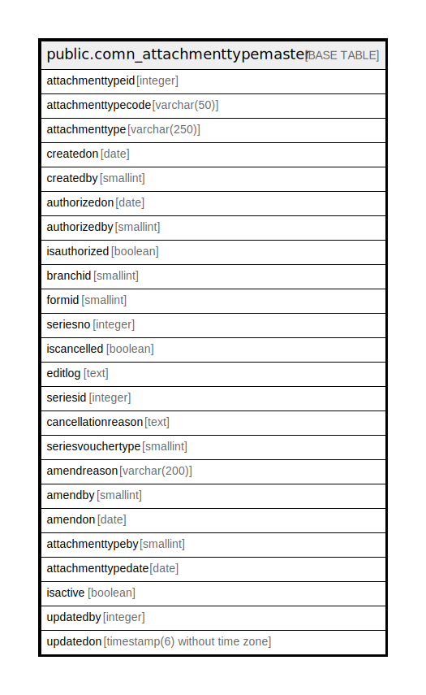

# public.comn_attachmenttypemaster

## Description

## Columns

| Name | Type | Default | Nullable | Children | Parents | Comment |
| ---- | ---- | ------- | -------- | -------- | ------- | ------- |
| attachmenttypeid | integer | nextval('comn_attachmenttypemaster_attachmenttypeid_seq'::regclass) | false |  |  |  |
| attachmenttypecode | varchar(50) |  | false |  |  |  |
| attachmenttype | varchar(250) |  | false |  |  |  |
| createdon | date |  | true |  |  |  |
| createdby | smallint |  | true |  |  |  |
| authorizedon | date |  | true |  |  |  |
| authorizedby | smallint |  | true |  |  |  |
| isauthorized | boolean |  | true |  |  |  |
| branchid | smallint |  | true |  |  |  |
| formid | smallint |  | false |  |  |  |
| seriesno | integer |  | true |  |  |  |
| iscancelled | boolean | false | true |  |  |  |
| editlog | text |  | true |  |  |  |
| seriesid | integer |  | true |  |  |  |
| cancellationreason | text |  | true |  |  |  |
| seriesvouchertype | smallint | 0 | true |  |  |  |
| amendreason | varchar(200) |  | true |  |  |  |
| amendby | smallint |  | true |  |  |  |
| amendon | date |  | true |  |  |  |
| attachmenttypeby | smallint |  | true |  |  |  |
| attachmenttypedate | date |  | true |  |  |  |
| isactive | boolean | true | true |  |  |  |
| updatedby | integer |  | true |  |  |  |
| updatedon | timestamp(6) without time zone | NULL::timestamp without time zone | true |  |  |  |

## Constraints

| Name | Type | Definition |
| ---- | ---- | ---------- |
| at | UNIQUE | UNIQUE (attachmenttypecode, branchid) |
| comn_attachmenttypemaster_pkey | PRIMARY KEY | PRIMARY KEY (attachmenttypeid) |

## Indexes

| Name | Definition |
| ---- | ---------- |
| at | CREATE UNIQUE INDEX at ON public.comn_attachmenttypemaster USING btree (attachmenttypecode, branchid) |
| comn_attachmenttypemaster_pkey | CREATE UNIQUE INDEX comn_attachmenttypemaster_pkey ON public.comn_attachmenttypemaster USING btree (attachmenttypeid) |

## Relations

---

> Generated by [tbls](https://github.com/k1LoW/tbls)
