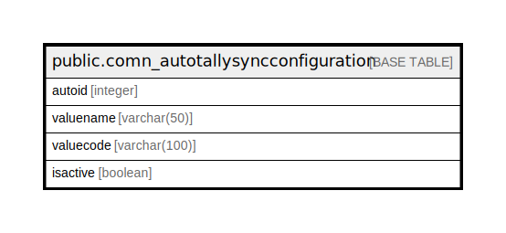

# public.comn_autotallysyncconfiguration

## Description

## Columns

| Name | Type | Default | Nullable | Children | Parents | Comment |
| ---- | ---- | ------- | -------- | -------- | ------- | ------- |
| autoid | integer |  | false |  |  |  |
| valuename | varchar(50) |  | false |  |  |  |
| valuecode | varchar(100) |  | true |  |  |  |
| isactive | boolean | true | false |  |  |  |

## Constraints

| Name | Type | Definition |
| ---- | ---- | ---------- |
| comn_autotallysyncconfiguration_pkey | PRIMARY KEY | PRIMARY KEY (autoid) |
| comn_autotallysyncconfiguration_valuename_key | UNIQUE | UNIQUE (valuename) |

## Indexes

| Name | Definition |
| ---- | ---------- |
| comn_autotallysyncconfiguration_pkey | CREATE UNIQUE INDEX comn_autotallysyncconfiguration_pkey ON public.comn_autotallysyncconfiguration USING btree (autoid) |
| comn_autotallysyncconfiguration_valuename_key | CREATE UNIQUE INDEX comn_autotallysyncconfiguration_valuename_key ON public.comn_autotallysyncconfiguration USING btree (valuename) |

## Relations

---

> Generated by [tbls](https://github.com/k1LoW/tbls)
