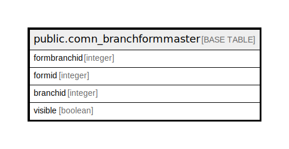

# public.comn_branchformmaster

## Description

## Columns

| Name | Type | Default | Nullable | Children | Parents | Comment |
| ---- | ---- | ------- | -------- | -------- | ------- | ------- |
| formbranchid | integer | nextval('comn_branchformmaster_formbranchid_seq'::regclass) | false |  |  |  |
| formid | integer |  | false |  |  |  |
| branchid | integer |  | false |  |  |  |
| visible | boolean | true | true |  |  |  |

## Constraints

| Name | Type | Definition |
| ---- | ---- | ---------- |
| comn_branchformmaster_pkey | PRIMARY KEY | PRIMARY KEY (formbranchid) |
| formbranchunique | UNIQUE | UNIQUE (formid, branchid) |

## Indexes

| Name | Definition |
| ---- | ---------- |
| comn_branchformmaster_pkey | CREATE UNIQUE INDEX comn_branchformmaster_pkey ON public.comn_branchformmaster USING btree (formbranchid) |
| formbranchunique | CREATE UNIQUE INDEX formbranchunique ON public.comn_branchformmaster USING btree (formid, branchid) |

## Relations

---

> Generated by [tbls](https://github.com/k1LoW/tbls)
