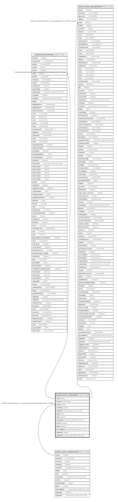

# public.comn_citymaster

## Description

## Columns

| Name | Type | Default | Nullable | Children | Parents | Comment |
| ---- | ---- | ------- | -------- | -------- | ------- | ------- |
| cityid | integer | nextval('comn_citymaster_cityid_seq'::regclass) | false | [public.branchmaster](public.branchmaster.md) [public.comn_partymaster](public.comn_partymaster.md) |  |  |
| cityname | varchar(30) |  | true |  |  |  |
| stateid | integer |  | false |  | [public.comn_statemaster](public.comn_statemaster.md) |  |
| createdby | integer |  | true |  |  |  |
| createdon | timestamp without time zone | now() | true |  |  |  |
| editlog | text |  | true |  |  |  |
| code | varchar |  | true |  |  |  |
| inactivedate | timestamp without time zone |  | true |  |  |  |
| isactive | boolean |  | true |  |  |  |
| alterid | integer |  | true |  |  |  |
| lastmodifiedon | timestamp(6) without time zone | now() | true |  |  |  |
| updatedby | integer |  | true |  |  |  |
| updatedon | timestamp(6) without time zone | NULL::timestamp without time zone | true |  |  |  |

## Constraints

| Name | Type | Definition |
| ---- | ---- | ---------- |
| citymaster_cityname_key | UNIQUE | UNIQUE (cityname, stateid) |
| citymaster_pkey | PRIMARY KEY | PRIMARY KEY (cityid) |
| comn_citymaster_cityname_key | UNIQUE | UNIQUE (cityname, stateid) |
| comn_citymaster_code_key | UNIQUE | UNIQUE (code) |
| citymaster_fk | FOREIGN KEY | FOREIGN KEY (stateid) REFERENCES comn_statemaster(stateid) ON UPDATE CASCADE ON DELETE CASCADE |

## Indexes

| Name | Definition |
| ---- | ---------- |
| citymaster_cityname_key | CREATE UNIQUE INDEX citymaster_cityname_key ON public.comn_citymaster USING btree (cityname, stateid) |
| citymaster_pkey | CREATE UNIQUE INDEX citymaster_pkey ON public.comn_citymaster USING btree (cityid) |
| comn_citymaster_cityname_key | CREATE UNIQUE INDEX comn_citymaster_cityname_key ON public.comn_citymaster USING btree (cityname, stateid) |
| comn_citymaster_code_key | CREATE UNIQUE INDEX comn_citymaster_code_key ON public.comn_citymaster USING btree (code) |

## Relations

---

> Generated by [tbls](https://github.com/k1LoW/tbls)
