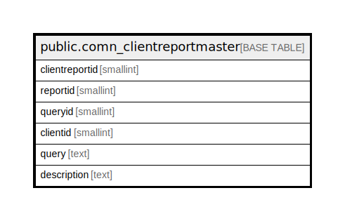

# public.comn_clientreportmaster

## Description

## Columns

| Name | Type | Default | Nullable | Children | Parents | Comment |
| ---- | ---- | ------- | -------- | -------- | ------- | ------- |
| clientreportid | smallint |  | false |  |  |  |
| reportid | smallint |  | false |  |  |  |
| queryid | smallint |  | false |  |  |  |
| clientid | smallint |  | false |  |  |  |
| query | text |  | true |  |  |  |
| description | text |  | true |  |  |  |

## Constraints

| Name | Type | Definition |
| ---- | ---- | ---------- |
| comn_clientreportmaster_pkey | PRIMARY KEY | PRIMARY KEY (clientreportid) |
| uniqueclientwisequery | UNIQUE | UNIQUE (queryid, clientid) |

## Indexes

| Name | Definition |
| ---- | ---------- |
| comn_clientreportmaster_pkey | CREATE UNIQUE INDEX comn_clientreportmaster_pkey ON public.comn_clientreportmaster USING btree (clientreportid) |
| uniqueclientwisequery | CREATE UNIQUE INDEX uniqueclientwisequery ON public.comn_clientreportmaster USING btree (queryid, clientid) |

## Relations

---

> Generated by [tbls](https://github.com/k1LoW/tbls)
