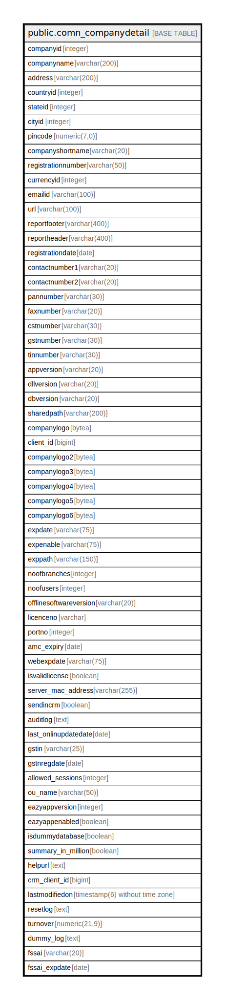

# public.comn_companydetail

## Description

## Columns

| Name | Type | Default | Nullable | Children | Parents | Comment |
| ---- | ---- | ------- | -------- | -------- | ------- | ------- |
| companyid | integer | nextval('comn_companydetail_companyid_seq'::regclass) | false |  |  |  |
| companyname | varchar(200) |  | true |  |  |  |
| address | varchar(200) |  | true |  |  |  |
| countryid | integer |  | true |  |  |  |
| stateid | integer |  | false |  |  |  |
| cityid | integer |  | true |  |  |  |
| pincode | numeric(7,0) |  | true |  |  |  |
| companyshortname | varchar(20) |  | true |  |  |  |
| registrationnumber | varchar(50) |  | true |  |  |  |
| currencyid | integer |  | true |  |  |  |
| emailid | varchar(100) |  | true |  |  |  |
| url | varchar(100) |  | true |  |  |  |
| reportfooter | varchar(400) |  | true |  |  |  |
| reportheader | varchar(400) |  | true |  |  |  |
| registrationdate | date |  | true |  |  |  |
| contactnumber1 | varchar(20) |  | true |  |  |  |
| contactnumber2 | varchar(20) |  | true |  |  |  |
| pannumber | varchar(30) |  | true |  |  |  |
| faxnumber | varchar(20) |  | true |  |  |  |
| cstnumber | varchar(30) |  | true |  |  |  |
| gstnumber | varchar(30) |  | true |  |  |  |
| tinnumber | varchar(30) |  | true |  |  |  |
| appversion | varchar(20) |  | true |  |  |  |
| dllversion | varchar(20) |  | true |  |  |  |
| dbversion | varchar(20) |  | true |  |  |  |
| sharedpath | varchar(200) |  | true |  |  |  |
| companylogo | bytea |  | true |  |  |  |
| client_id | bigint |  | true |  |  |  |
| companylogo2 | bytea |  | true |  |  |  |
| companylogo3 | bytea |  | true |  |  |  |
| companylogo4 | bytea |  | true |  |  |  |
| companylogo5 | bytea |  | true |  |  |  |
| companylogo6 | bytea |  | true |  |  |  |
| expdate | varchar(75) |  | true |  |  |  |
| expenable | varchar(75) |  | true |  |  |  |
| exppath | varchar(150) |  | true |  |  |  |
| noofbranches | integer | 1 | true |  |  |  |
| noofusers | integer | 100 | true |  |  |  |
| offlinesoftwareversion | varchar(20) |  | true |  |  |  |
| licenceno | varchar |  | true |  |  |  |
| portno | integer |  | true |  |  |  |
| amc_expiry | date |  | true |  |  |  |
| webexpdate | varchar(75) |  | true |  |  |  |
| isvalidlicense | boolean | true | true |  |  |  |
| server_mac_address | varchar(255) |  | true |  |  |  |
| sendincrm | boolean | false | true |  |  |  |
| auditlog | text |  | true |  |  |  |
| last_onlinupdatedate | date |  | true |  |  |  |
| gstin | varchar(25) |  | true |  |  |  |
| gstnregdate | date |  | true |  |  |  |
| allowed_sessions | integer | 1 | true |  |  |  |
| ou_name | varchar(50) | ''::character varying | true |  |  |  |
| eazyappversion | integer |  | true |  |  |  |
| eazyappenabled | boolean |  | true |  |  |  |
| isdummydatabase | boolean |  | true |  |  |  |
| summary_in_million | boolean | false | true |  |  |  |
| helpurl | text |  | true |  |  |  |
| crm_client_id | bigint |  | true |  |  |  |
| lastmodifiedon | timestamp(6) without time zone | now() | true |  |  |  |
| resetlog | text |  | true |  |  |  |
| turnover | numeric(21,9) | 0 | true |  |  |  |
| dummy_log | text |  | true |  |  |  |
| fssai | varchar(20) |  | true |  |  |  |
| fssai_expdate | date |  | true |  |  |  |

## Constraints

| Name | Type | Definition |
| ---- | ---- | ---------- |
| comn_companydetail_companyid_key | UNIQUE | UNIQUE (companyid) |
| comn_companydetail_pkey | PRIMARY KEY | PRIMARY KEY (companyid) |

## Indexes

| Name | Definition |
| ---- | ---------- |
| comn_companydetail_companyid_key | CREATE UNIQUE INDEX comn_companydetail_companyid_key ON public.comn_companydetail USING btree (companyid) |
| comn_companydetail_pkey | CREATE UNIQUE INDEX comn_companydetail_pkey ON public.comn_companydetail USING btree (companyid) |

## Triggers

| Name | Definition |
| ---- | ---------- |
| updateauditlog | CREATE TRIGGER updateauditlog BEFORE UPDATE OF auditlog ON public.comn_companydetail FOR EACH ROW EXECUTE FUNCTION prevent_update() |
| updateclientid | CREATE TRIGGER updateclientid BEFORE UPDATE OF client_id ON public.comn_companydetail FOR EACH ROW EXECUTE FUNCTION prevent_update() |

## Relations

---

> Generated by [tbls](https://github.com/k1LoW/tbls)
