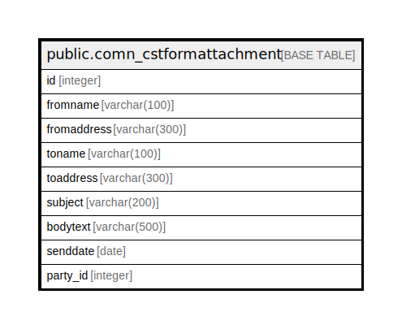

# public.comn_cstformattachment

## Description

## Columns

| Name | Type | Default | Nullable | Children | Parents | Comment |
| ---- | ---- | ------- | -------- | -------- | ------- | ------- |
| id | integer | nextval('comn_cstformattachment_id_seq'::regclass) | false |  |  |  |
| fromname | varchar(100) |  | true |  |  |  |
| fromaddress | varchar(300) |  | true |  |  |  |
| toname | varchar(100) |  | true |  |  |  |
| toaddress | varchar(300) |  | true |  |  |  |
| subject | varchar(200) |  | true |  |  |  |
| bodytext | varchar(500) |  | true |  |  |  |
| senddate | date |  | true |  |  |  |
| party_id | integer |  | true |  |  |  |

## Constraints

| Name | Type | Definition |
| ---- | ---- | ---------- |
| comn_cstformattachment_pkey | PRIMARY KEY | PRIMARY KEY (id) |

## Indexes

| Name | Definition |
| ---- | ---------- |
| comn_cstformattachment_pkey | CREATE UNIQUE INDEX comn_cstformattachment_pkey ON public.comn_cstformattachment USING btree (id) |

## Relations

---

> Generated by [tbls](https://github.com/k1LoW/tbls)
