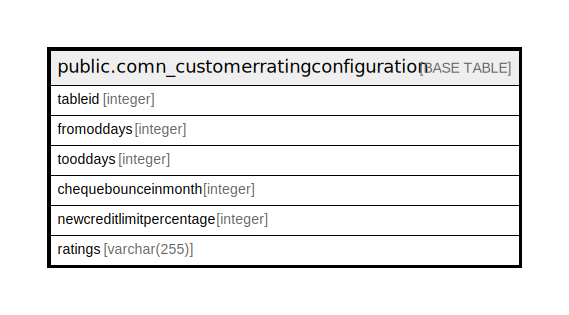

# public.comn_customerratingconfiguration

## Description

## Columns

| Name | Type | Default | Nullable | Children | Parents | Comment |
| ---- | ---- | ------- | -------- | -------- | ------- | ------- |
| tableid | integer | nextval('comn_customerratingconfiguration_tableid_seq'::regclass) | false |  |  |  |
| fromoddays | integer | 0 | false |  |  |  |
| tooddays | integer | 0 | false |  |  |  |
| chequebounceinmonth | integer | 0 | false |  |  |  |
| newcreditlimitpercentage | integer | 0 | false |  |  |  |
| ratings | varchar(255) | ''::character varying | false |  |  |  |

## Constraints

| Name | Type | Definition |
| ---- | ---- | ---------- |
| comn_customerratingconfiguration_pkey | PRIMARY KEY | PRIMARY KEY (tableid) |

## Indexes

| Name | Definition |
| ---- | ---------- |
| comn_customerratingconfiguration_pkey | CREATE UNIQUE INDEX comn_customerratingconfiguration_pkey ON public.comn_customerratingconfiguration USING btree (tableid) |

## Relations

---

> Generated by [tbls](https://github.com/k1LoW/tbls)
