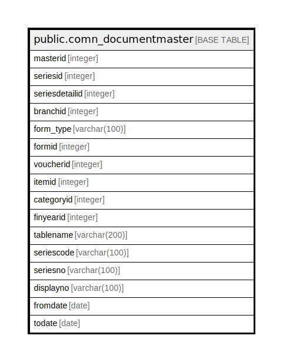

# public.comn_documentmaster

## Description

## Columns

| Name | Type | Default | Nullable | Children | Parents | Comment |
| ---- | ---- | ------- | -------- | -------- | ------- | ------- |
| masterid | integer | nextval('comn_documentmaster_masterid_seq'::regclass) | false |  |  |  |
| seriesid | integer |  | true |  |  |  |
| seriesdetailid | integer |  | true |  |  |  |
| branchid | integer |  | true |  |  |  |
| form_type | varchar(100) |  | true |  |  | --> FORMID,ITEMID,BATCH,SERIAL |
| formid | integer |  | true |  |  |  |
| voucherid | integer |  | true |  |  | --> comn_voucher table field |
| itemid | integer |  | true |  |  |  |
| categoryid | integer |  | true |  |  |  |
| finyearid | integer |  | true |  |  |  |
| tablename | varchar(200) |  | true |  |  |  |
| seriescode | varchar(100) |  | true |  |  |  |
| seriesno | varchar(100) |  | true |  |  |  |
| displayno | varchar(100) |  | true |  |  |  |
| fromdate | date |  | true |  |  | --> its based on monthly quaterly periodcly halfyearly yearly |
| todate | date |  | true |  |  |  |

## Constraints

| Name | Type | Definition |
| ---- | ---- | ---------- |
| comn_documentmaster_pkey | PRIMARY KEY | PRIMARY KEY (masterid) |

## Indexes

| Name | Definition |
| ---- | ---------- |
| comn_documentmaster_pkey | CREATE UNIQUE INDEX comn_documentmaster_pkey ON public.comn_documentmaster USING btree (masterid) |

## Relations

---

> Generated by [tbls](https://github.com/k1LoW/tbls)
