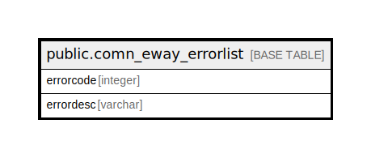

# public.comn_eway_errorlist

## Description

## Columns

| Name | Type | Default | Nullable | Children | Parents | Comment |
| ---- | ---- | ------- | -------- | -------- | ------- | ------- |
| errorcode | integer |  | false |  |  |  |
| errordesc | varchar |  | true |  |  |  |

## Constraints

| Name | Type | Definition |
| ---- | ---- | ---------- |
| comn_eway_errorlist_errorcode_key | UNIQUE | UNIQUE (errorcode) |

## Indexes

| Name | Definition |
| ---- | ---------- |
| comn_eway_errorlist_errorcode_key | CREATE UNIQUE INDEX comn_eway_errorlist_errorcode_key ON public.comn_eway_errorlist USING btree (errorcode) |

## Relations

---

> Generated by [tbls](https://github.com/k1LoW/tbls)
