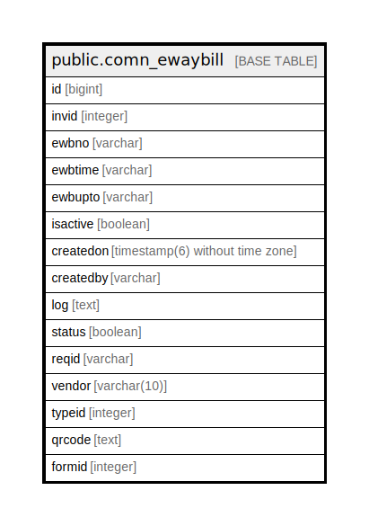

# public.comn_ewaybill

## Description

## Columns

| Name | Type | Default | Nullable | Children | Parents | Comment |
| ---- | ---- | ------- | -------- | -------- | ------- | ------- |
| id | bigint | nextval('comn_ewaybill_id'::regclass) | false |  |  |  |
| invid | integer |  | true |  |  |  |
| ewbno | varchar |  | true |  |  |  |
| ewbtime | varchar |  | true |  |  |  |
| ewbupto | varchar |  | true |  |  |  |
| isactive | boolean | true | true |  |  |  |
| createdon | timestamp(6) without time zone | now() | true |  |  |  |
| createdby | varchar |  | true |  |  |  |
| log | text |  | true |  |  |  |
| status | boolean | false | true |  |  |  |
| reqid | varchar |  | true |  |  |  |
| vendor | varchar(10) |  | true |  |  |  |
| typeid | integer | 0 | false |  |  |  |
| qrcode | text |  | true |  |  |  |
| formid | integer | 0 | false |  |  |  |

## Constraints

| Name | Type | Definition |
| ---- | ---- | ---------- |
| comn_ewaybill_pkey | PRIMARY KEY | PRIMARY KEY (id) |

## Indexes

| Name | Definition |
| ---- | ---------- |
| comn_ewaybill_pkey | CREATE UNIQUE INDEX comn_ewaybill_pkey ON public.comn_ewaybill USING btree (id) |

## Relations

---

> Generated by [tbls](https://github.com/k1LoW/tbls)
