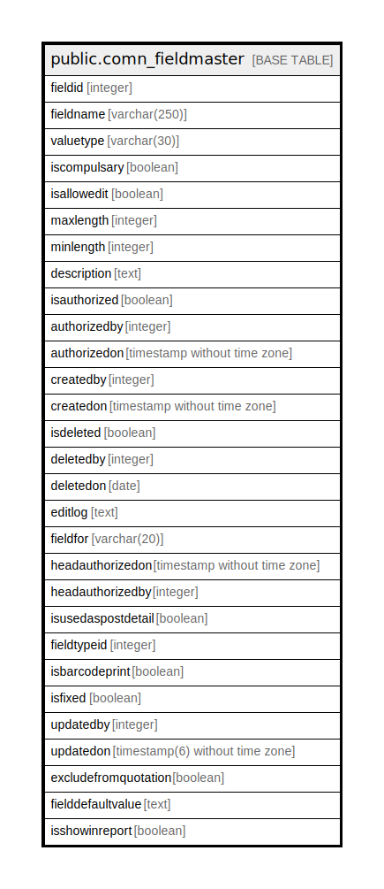

# public.comn_fieldmaster

## Description

## Columns

| Name | Type | Default | Nullable | Children | Parents | Comment |
| ---- | ---- | ------- | -------- | -------- | ------- | ------- |
| fieldid | integer | nextval('comn_fieldmaster_new_fieldid_seq'::regclass) | false |  |  |  |
| fieldname | varchar(250) |  | true |  |  |  |
| valuetype | varchar(30) |  | true |  |  |  |
| iscompulsary | boolean |  | true |  |  |  |
| isallowedit | boolean |  | true |  |  |  |
| maxlength | integer | 300 | true |  |  |  |
| minlength | integer | 0 | true |  |  |  |
| description | text |  | true |  |  |  |
| isauthorized | boolean |  | true |  |  |  |
| authorizedby | integer |  | true |  |  |  |
| authorizedon | timestamp without time zone |  | true |  |  |  |
| createdby | integer |  | true |  |  |  |
| createdon | timestamp without time zone | now() | true |  |  |  |
| isdeleted | boolean |  | true |  |  |  |
| deletedby | integer |  | true |  |  |  |
| deletedon | date |  | true |  |  |  |
| editlog | text |  | true |  |  |  |
| fieldfor | varchar(20) |  | true |  |  |  |
| headauthorizedon | timestamp without time zone |  | true |  |  |  |
| headauthorizedby | integer |  | true |  |  |  |
| isusedaspostdetail | boolean | false | true |  |  |  |
| fieldtypeid | integer |  | true |  |  |  |
| isbarcodeprint | boolean | false | false |  |  |  |
| isfixed | boolean | false | false |  |  | IsFixed column must be TRUE when field created by developer and user cannot edit in the frontend |
| updatedby | integer |  | true |  |  |  |
| updatedon | timestamp(6) without time zone | NULL::timestamp without time zone | true |  |  |  |
| excludefromquotation | boolean | false | true |  |  |  |
| fielddefaultvalue | text |  | true |  |  |  |
| isshowinreport | boolean | true | true |  |  |  |

## Constraints

| Name | Type | Definition |
| ---- | ---- | ---------- |
| comn_fieldmaster_new_pkey | PRIMARY KEY | PRIMARY KEY (fieldid) |

## Indexes

| Name | Definition |
| ---- | ---------- |
| comn_fieldmaster_new_pkey | CREATE UNIQUE INDEX comn_fieldmaster_new_pkey ON public.comn_fieldmaster USING btree (fieldid) |

## Relations

---

> Generated by [tbls](https://github.com/k1LoW/tbls)
