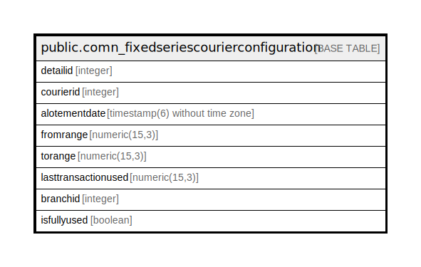

# public.comn_fixedseriescourierconfiguration

## Description

## Columns

| Name | Type | Default | Nullable | Children | Parents | Comment |
| ---- | ---- | ------- | -------- | -------- | ------- | ------- |
| detailid | integer | nextval('comn_fixedseriescourierconfiguration_detailid_seq'::regclass) | false |  |  |  |
| courierid | integer |  | true |  |  |  |
| alotementdate | timestamp(6) without time zone |  | true |  |  |  |
| fromrange | numeric(15,3) |  | true |  |  |  |
| torange | numeric(15,3) |  | true |  |  |  |
| lasttransactionused | numeric(15,3) |  | true |  |  |  |
| branchid | integer |  | true |  |  |  |
| isfullyused | boolean |  | true |  |  |  |

## Relations

---

> Generated by [tbls](https://github.com/k1LoW/tbls)
