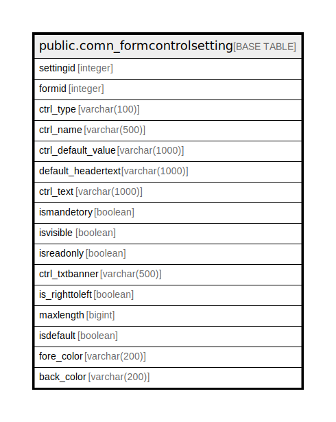

# public.comn_formcontrolsetting

## Description

## Columns

| Name | Type | Default | Nullable | Children | Parents | Comment |
| ---- | ---- | ------- | -------- | -------- | ------- | ------- |
| settingid | integer | nextval('comn_formcontrolsetting_settingid_seq'::regclass) | false |  |  |  |
| formid | integer |  | true |  |  |  |
| ctrl_type | varchar(100) |  | true |  |  |  |
| ctrl_name | varchar(500) |  | true |  |  |  |
| ctrl_default_value | varchar(1000) |  | true |  |  |  |
| default_headertext | varchar(1000) |  | true |  |  |  |
| ctrl_text | varchar(1000) |  | true |  |  |  |
| ismandetory | boolean | false | true |  |  |  |
| isvisible | boolean | true | true |  |  |  |
| isreadonly | boolean | false | true |  |  |  |
| ctrl_txtbanner | varchar(500) |  | true |  |  |  |
| is_righttoleft | boolean | false | true |  |  |  |
| maxlength | bigint | '-1'::integer | true |  |  |  |
| isdefault | boolean | true | true |  |  |  |
| fore_color | varchar(200) |  | true |  |  |  |
| back_color | varchar(200) |  | true |  |  |  |

## Constraints

| Name | Type | Definition |
| ---- | ---- | ---------- |
| comn_formcontrolsetting_pkey | PRIMARY KEY | PRIMARY KEY (settingid) |

## Indexes

| Name | Definition |
| ---- | ---------- |
| comn_formcontrolsetting_pkey | CREATE UNIQUE INDEX comn_formcontrolsetting_pkey ON public.comn_formcontrolsetting USING btree (settingid) |

## Relations

---

> Generated by [tbls](https://github.com/k1LoW/tbls)
