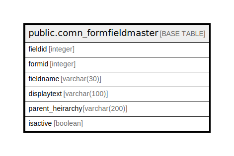

# public.comn_formfieldmaster

## Description

## Columns

| Name | Type | Default | Nullable | Children | Parents | Comment |
| ---- | ---- | ------- | -------- | -------- | ------- | ------- |
| fieldid | integer | nextval('comn_formfieldmaster_fieldid_seq'::regclass) | false |  |  |  |
| formid | integer |  | true |  |  |  |
| fieldname | varchar(30) |  | true |  |  |  |
| displaytext | varchar(100) |  | true |  |  |  |
| parent_heirarchy | varchar(200) |  | true |  |  |  |
| isactive | boolean | false | true |  |  |  |

## Constraints

| Name | Type | Definition |
| ---- | ---- | ---------- |
| formfieldmaster_pkey | PRIMARY KEY | PRIMARY KEY (fieldid) |

## Indexes

| Name | Definition |
| ---- | ---------- |
| formfieldmaster_pkey | CREATE UNIQUE INDEX formfieldmaster_pkey ON public.comn_formfieldmaster USING btree (fieldid) |

## Relations

---

> Generated by [tbls](https://github.com/k1LoW/tbls)
