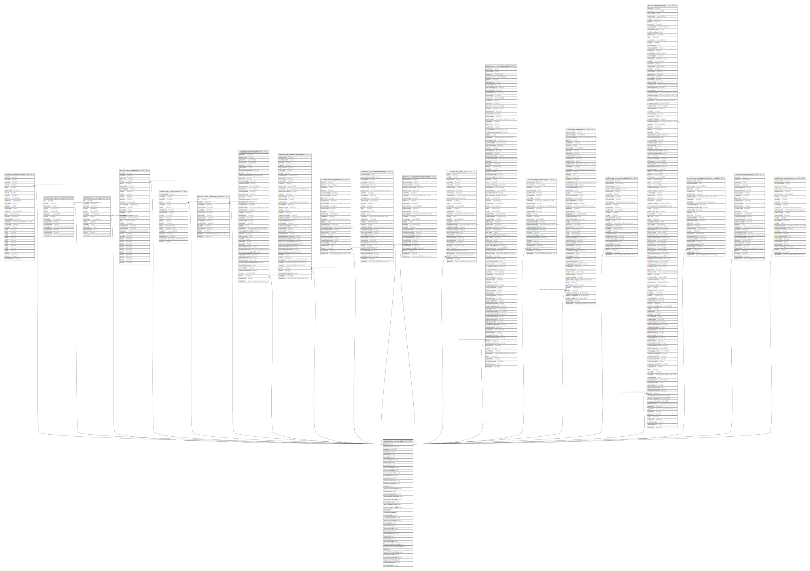

# public.comn_formmaster

## Description

## Columns

| Name | Type | Default | Nullable | Children | Parents | Comment |
| ---- | ---- | ------- | -------- | -------- | ------- | ------- |
| formid | integer |  | false | [public.comn_batchmaster](public.comn_batchmaster.md) [public.comn_gstr_invoice](public.comn_gstr_invoice.md) [public.comn_gstr_log](public.comn_gstr_log.md) [public.comn_serialmaster](public.comn_serialmaster.md) [public.comn_stockdetail](public.comn_stockdetail.md) [public.comn_tablemap_sum](public.comn_tablemap_sum.md) [public.prod_itemjobwork](public.prod_itemjobwork.md) [public.prod_productionmaster](public.prod_productionmaster.md) [public.prod_stageissue](public.prod_stageissue.md) [public.pur_inspectionaftermrn](public.pur_inspectionaftermrn.md) [public.pur_inspectionbeforemrn](public.pur_inspectionbeforemrn.md) [public.pur_mrn](public.pur_mrn.md) [public.pur_purchaseinvoice](public.pur_purchaseinvoice.md) [public.qlty_inspection](public.qlty_inspection.md) [public.sale_deliverynote](public.sale_deliverynote.md) [public.sale_inspectionafterdn](public.sale_inspectionafterdn.md) [public.sale_salesinvoice](public.sale_salesinvoice.md) [public.stor_stockadjustmentortransfer](public.stor_stockadjustmentortransfer.md) [public.stor_storeissue](public.stor_storeissue.md) [public.stor_storeissuereturn](public.stor_storeissuereturn.md) |  |  |
| formname | varchar(100) |  | false |  |  |  |
| caption | varchar(100) |  | false |  |  |  |
| formtype | smallint |  | false |  |  |  |
| mnunew | boolean | false | false |  |  |  |
| mnuedit | boolean | false | false |  |  |  |
| mnuauthorize | boolean | false | false |  |  |  |
| mnuview | boolean | false | false |  |  |  |
| mnuprint | boolean | false | false |  |  |  |
| mnuamendment | boolean | false | false |  |  |  |
| mnusendtotally | boolean | false | false |  |  |  |
| mnuexporttoexcel | boolean | false | false |  |  |  |
| extravalue | varchar(50) |  | true |  |  |  |
| formval | varchar(70) |  | true |  |  |  |
| isauthorizationreq | boolean | true | false |  |  |  |
| mnuclosepending | boolean |  | false |  |  |  |
| visible | boolean | true | false |  |  |  |
| mnucanceltransaction | boolean | false | true |  |  |  |
| formgroupid | integer |  | true |  |  |  |
| allowbackdateentry | boolean | false | true |  |  |  |
| isheadauthorizationreq | boolean | false | true |  |  |  |
| roundoffitemlevelamt | integer | 2 | true |  |  |  |
| mnuattachment | boolean | false | false |  |  |  |
| mnuviewattachment | boolean | false | false |  |  |  |
| bamount_auth_enable | boolean |  | true |  |  |  |
| formpath | text |  | true |  |  |  |
| backdateenddate | date |  | true |  |  |  |
| saveandprint | boolean | false | false |  |  |  |
| saveandauthorize | boolean | false | false |  |  |  |
| mnucreatestructure | boolean | false | false |  |  |  |
| mnuimport | boolean | false | false |  |  |  |
| tb_name | varchar |  | true |  |  |  |
| mnuprintserial | boolean | false | false |  |  |  |
| mnuemail | boolean |  | true |  |  |  |
| mnuunauthorize | boolean |  | true |  |  |  |
| report_id | integer |  | true |  |  |  |
| isautomail | boolean | false | true |  |  |  |
| printfromdbqry | boolean | false | false |  |  |  |
| showitemattributeonreport | boolean | false | false |  |  |  |
| bydefaultselectallitemattribute | boolean | false | false |  |  |  |
| helpurl | text |  | true |  |  |  |
| roundoffitemlevelgstrate | integer |  | true |  |  |  |
| isforglobalseries | boolean | false | true |  |  |  |
| saveandprintbarcode | boolean | false | true |  |  |  |
| discperdecimallimit | integer | 2 | true |  |  |  |
| isbackdateimpact | boolean | false | true |  |  |  |
| mnuwhatsapp | boolean | false | true |  |  |  |

## Constraints

| Name | Type | Definition |
| ---- | ---- | ---------- |
| formmaster_pkey | PRIMARY KEY | PRIMARY KEY (formid) |
| formmaster_report_id | UNIQUE | UNIQUE (report_id) |

## Indexes

| Name | Definition |
| ---- | ---------- |
| formmaster_pkey | CREATE UNIQUE INDEX formmaster_pkey ON public.comn_formmaster USING btree (formid) |
| formmaster_report_id | CREATE UNIQUE INDEX formmaster_report_id ON public.comn_formmaster USING btree (report_id) |

## Triggers

| Name | Definition |
| ---- | ---------- |
| append_master_role | CREATE TRIGGER append_master_role AFTER INSERT ON public.comn_formmaster FOR EACH ROW EXECUTE FUNCTION append_master_role() |
| update_branchformmaster | CREATE TRIGGER update_branchformmaster AFTER INSERT ON public.comn_formmaster FOR EACH ROW EXECUTE FUNCTION branchformmaster_autoentry() |
| update_from_visible | CREATE TRIGGER update_from_visible AFTER UPDATE ON public.comn_formmaster FOR EACH ROW EXECUTE FUNCTION update_from_visible() |
| update_master_role | CREATE TRIGGER update_master_role AFTER UPDATE ON public.comn_formmaster FOR EACH ROW EXECUTE FUNCTION update_master_role() |
| voucher_entry | CREATE TRIGGER voucher_entry AFTER INSERT ON public.comn_formmaster FOR EACH ROW EXECUTE FUNCTION voucher_autoentry() |

## Relations

---

> Generated by [tbls](https://github.com/k1LoW/tbls)
