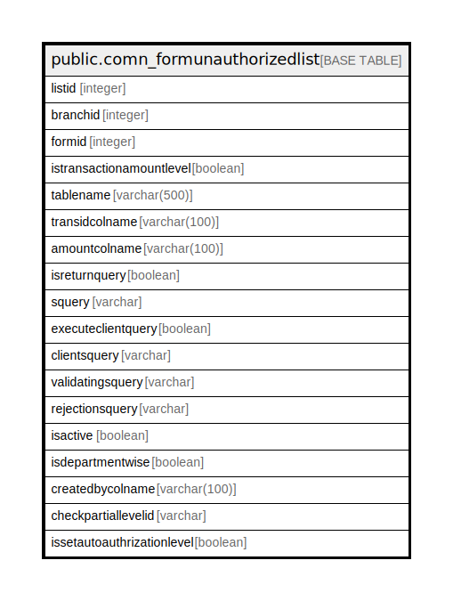

# public.comn_formunauthorizedlist

## Description

## Columns

| Name | Type | Default | Nullable | Children | Parents | Comment |
| ---- | ---- | ------- | -------- | -------- | ------- | ------- |
| listid | integer | nextval('comn_formunauthorizedlist_listid_seq'::regclass) | false |  |  |  |
| branchid | integer |  | true |  |  |  |
| formid | integer |  | true |  |  |  |
| istransactionamountlevel | boolean | false | false |  |  |  |
| tablename | varchar(500) |  | true |  |  |  |
| transidcolname | varchar(100) |  | true |  |  |  |
| amountcolname | varchar(100) |  | true |  |  |  |
| isreturnquery | boolean | false | false |  |  |  |
| squery | varchar |  | true |  |  |  |
| executeclientquery | boolean | false | true |  |  |  |
| clientsquery | varchar |  | true |  |  |  |
| validatingsquery | varchar |  | true |  |  |  |
| rejectionsquery | varchar |  | true |  |  |  |
| isactive | boolean | true | true |  |  |  |
| isdepartmentwise | boolean | false | true |  |  |  |
| createdbycolname | varchar(100) | NULL::character varying | true |  |  |  |
| checkpartiallevelid | varchar |  | true |  |  |  |
| issetautoauthrizationlevel | boolean | false | true |  |  |  |

## Constraints

| Name | Type | Definition |
| ---- | ---- | ---------- |
| comn_formunauthorizedlist_pkey | PRIMARY KEY | PRIMARY KEY (listid) |

## Indexes

| Name | Definition |
| ---- | ---------- |
| comn_formunauthorizedlist_pkey | CREATE UNIQUE INDEX comn_formunauthorizedlist_pkey ON public.comn_formunauthorizedlist USING btree (listid) |

## Relations

---

> Generated by [tbls](https://github.com/k1LoW/tbls)
