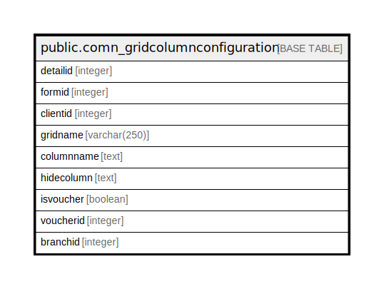

# public.comn_gridcolumnconfiguration

## Description

## Columns

| Name | Type | Default | Nullable | Children | Parents | Comment |
| ---- | ---- | ------- | -------- | -------- | ------- | ------- |
| detailid | integer | nextval('comn_gridcolumnconfiguration_detailid_seq'::regclass) | false |  |  |  |
| formid | integer |  | true |  |  |  |
| clientid | integer |  | true |  |  |  |
| gridname | varchar(250) |  | true |  |  |  |
| columnname | text |  | true |  |  |  |
| hidecolumn | text |  | true |  |  |  |
| isvoucher | boolean | false | true |  |  |  |
| voucherid | integer | 0 | true |  |  |  |
| branchid | integer | 0 | true |  |  |  |

## Relations

---

> Generated by [tbls](https://github.com/k1LoW/tbls)
