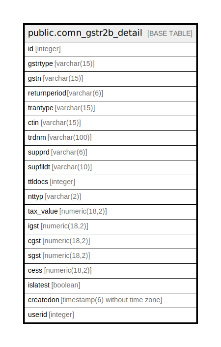

# public.comn_gstr2b_detail

## Description

## Columns

| Name | Type | Default | Nullable | Children | Parents | Comment |
| ---- | ---- | ------- | -------- | -------- | ------- | ------- |
| id | integer | nextval('comn_gstr2b_detail_id_seq'::regclass) | false |  |  |  |
| gstrtype | varchar(15) |  | false |  |  |  |
| gstn | varchar(15) |  | false |  |  |  |
| returnperiod | varchar(6) |  | false |  |  |  |
| trantype | varchar(15) |  | true |  |  |  |
| ctin | varchar(15) |  | true |  |  |  |
| trdnm | varchar(100) |  | true |  |  |  |
| supprd | varchar(6) |  | true |  |  |  |
| supfildt | varchar(10) |  | true |  |  |  |
| ttldocs | integer |  | true |  |  |  |
| nttyp | varchar(2) |  | true |  |  |  |
| tax_value | numeric(18,2) |  | true |  |  |  |
| igst | numeric(18,2) |  | true |  |  |  |
| cgst | numeric(18,2) |  | true |  |  |  |
| sgst | numeric(18,2) |  | true |  |  |  |
| cess | numeric(18,2) |  | true |  |  |  |
| islatest | boolean | true | false |  |  |  |
| createdon | timestamp(6) without time zone | now() | true |  |  |  |
| userid | integer |  | true |  |  |  |

## Constraints

| Name | Type | Definition |
| ---- | ---- | ---------- |
| comn_gstr2b_detail_pkey | PRIMARY KEY | PRIMARY KEY (id) |

## Indexes

| Name | Definition |
| ---- | ---------- |
| comn_gstr2b_detail_pkey | CREATE UNIQUE INDEX comn_gstr2b_detail_pkey ON public.comn_gstr2b_detail USING btree (id) |

## Relations

---

> Generated by [tbls](https://github.com/k1LoW/tbls)
