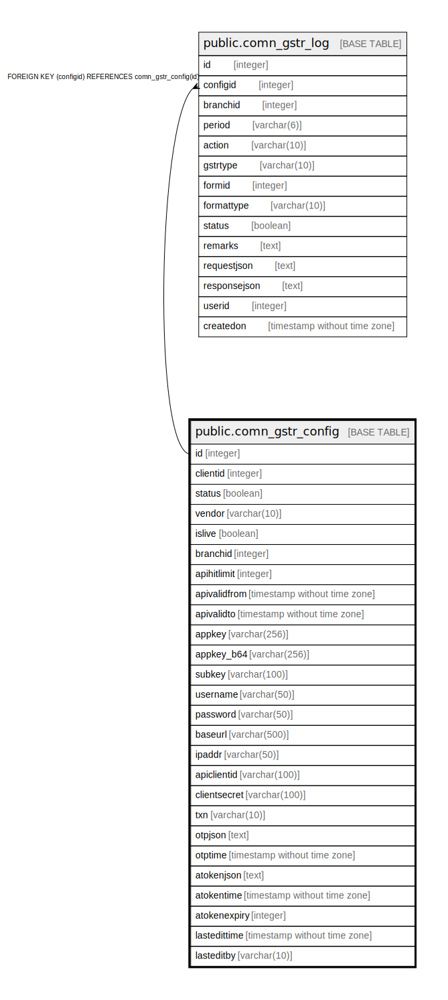

# public.comn_gstr_config

## Description

## Columns

| Name | Type | Default | Nullable | Children | Parents | Comment |
| ---- | ---- | ------- | -------- | -------- | ------- | ------- |
| id | integer | nextval('comn_gstr_config_id'::regclass) | false | [public.comn_gstr_log](public.comn_gstr_log.md) |  |  |
| clientid | integer | 0 | false |  |  |  |
| status | boolean | false | true |  |  |  |
| vendor | varchar(10) |  | false |  |  |  |
| islive | boolean | false | true |  |  |  |
| branchid | integer | 0 | true |  |  |  |
| apihitlimit | integer | 0 | true |  |  |  |
| apivalidfrom | timestamp without time zone | now() | true |  |  |  |
| apivalidto | timestamp without time zone | now() | true |  |  |  |
| appkey | varchar(256) |  | true |  |  |  |
| appkey_b64 | varchar(256) |  | true |  |  |  |
| subkey | varchar(100) |  | true |  |  |  |
| username | varchar(50) |  | true |  |  |  |
| password | varchar(50) |  | true |  |  |  |
| baseurl | varchar(500) |  | true |  |  |  |
| ipaddr | varchar(50) |  | true |  |  |  |
| apiclientid | varchar(100) |  | true |  |  |  |
| clientsecret | varchar(100) |  | true |  |  |  |
| txn | varchar(10) |  | true |  |  |  |
| otpjson | text |  | true |  |  |  |
| otptime | timestamp without time zone | now() | true |  |  |  |
| atokenjson | text |  | true |  |  |  |
| atokentime | timestamp without time zone | now() | true |  |  |  |
| atokenexpiry | integer | 0 | true |  |  |  |
| lastedittime | timestamp without time zone | now() | true |  |  |  |
| lasteditby | varchar(10) |  | true |  |  |  |

## Constraints

| Name | Type | Definition |
| ---- | ---- | ---------- |
| comn_gstr_config_pkey | PRIMARY KEY | PRIMARY KEY (id) |

## Indexes

| Name | Definition |
| ---- | ---------- |
| comn_gstr_config_pkey | CREATE UNIQUE INDEX comn_gstr_config_pkey ON public.comn_gstr_config USING btree (id) |
| in_comn_gstr_config | CREATE UNIQUE INDEX in_comn_gstr_config ON public.comn_gstr_config USING btree (clientid, status, branchid, islive) WHERE (status = true) |

## Relations

---

> Generated by [tbls](https://github.com/k1LoW/tbls)
