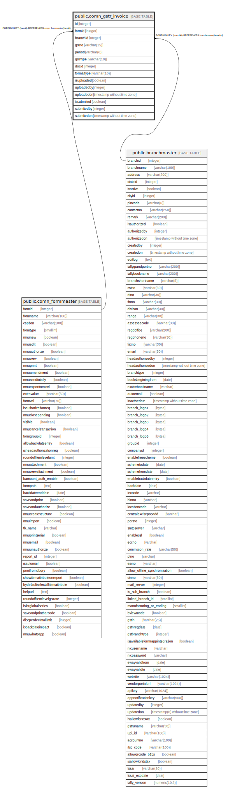

# public.comn_gstr_invoice

## Description

## Columns

| Name | Type | Default | Nullable | Children | Parents | Comment |
| ---- | ---- | ------- | -------- | -------- | ------- | ------- |
| id | integer | nextval('comn_gstr_invoice_id'::regclass) | false |  |  |  |
| formid | integer |  | false |  | [public.comn_formmaster](public.comn_formmaster.md) |  |
| branchid | integer |  | false |  | [public.branchmaster](public.branchmaster.md) |  |
| gstno | varchar(15) |  | false |  |  |  |
| period | varchar(6) |  | false |  |  |  |
| gstrtype | varchar(10) |  | false |  |  |  |
| docid | integer |  | false |  |  |  |
| formattype | varchar(10) |  | false |  |  |  |
| isuploaded | boolean | false | true |  |  |  |
| uploadedby | integer |  | true |  |  |  |
| uploadedon | timestamp without time zone |  | true |  |  |  |
| issubmited | boolean | false | true |  |  |  |
| submitedby | integer |  | true |  |  |  |
| submitedon | timestamp without time zone |  | true |  |  |  |

## Constraints

| Name | Type | Definition |
| ---- | ---- | ---------- |
| comn_gstr_invoice_branchid_fkey | FOREIGN KEY | FOREIGN KEY (branchid) REFERENCES branchmaster(branchid) |
| comn_gstr_invoice_pkey | PRIMARY KEY | PRIMARY KEY (id) |
| comn_gstr_invoice_formid_fkey | FOREIGN KEY | FOREIGN KEY (formid) REFERENCES comn_formmaster(formid) |

## Indexes

| Name | Definition |
| ---- | ---------- |
| comn_gstr_invoice_pkey | CREATE UNIQUE INDEX comn_gstr_invoice_pkey ON public.comn_gstr_invoice USING btree (id) |

## Relations

---

> Generated by [tbls](https://github.com/k1LoW/tbls)
