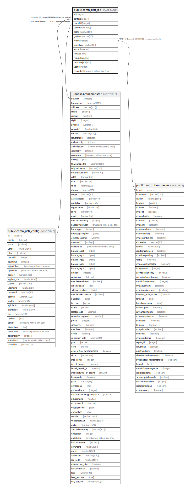

# public.comn_gstr_log

## Description

## Columns

| Name | Type | Default | Nullable | Children | Parents | Comment |
| ---- | ---- | ------- | -------- | -------- | ------- | ------- |
| id | integer | nextval('comn_gstr_log_id'::regclass) | false |  |  |  |
| configid | integer |  | false |  | [public.comn_gstr_config](public.comn_gstr_config.md) |  |
| branchid | integer |  | false |  | [public.branchmaster](public.branchmaster.md) |  |
| period | varchar(6) |  | true |  |  |  |
| action | varchar(10) |  | false |  |  |  |
| gstrtype | varchar(10) |  | false |  |  |  |
| formid | integer |  | false |  | [public.comn_formmaster](public.comn_formmaster.md) |  |
| formattype | varchar(10) |  | false |  |  |  |
| status | boolean | true | true |  |  |  |
| remarks | text |  | true |  |  |  |
| requestjson | text |  | true |  |  |  |
| responsejson | text |  | true |  |  |  |
| userid | integer |  | true |  |  |  |
| createdon | timestamp without time zone | now() | true |  |  |  |

## Constraints

| Name | Type | Definition |
| ---- | ---- | ---------- |
| comn_gstr_log_branchid_fkey | FOREIGN KEY | FOREIGN KEY (branchid) REFERENCES branchmaster(branchid) |
| comn_gstr_log_configid_fkey | FOREIGN KEY | FOREIGN KEY (configid) REFERENCES comn_gstr_config(id) |
| comn_gstr_log_pkey | PRIMARY KEY | PRIMARY KEY (id) |
| comn_gstr_log_formid_fkey | FOREIGN KEY | FOREIGN KEY (formid) REFERENCES comn_formmaster(formid) |

## Indexes

| Name | Definition |
| ---- | ---------- |
| comn_gstr_log_pkey | CREATE UNIQUE INDEX comn_gstr_log_pkey ON public.comn_gstr_log USING btree (id) |

## Relations

---

> Generated by [tbls](https://github.com/k1LoW/tbls)
