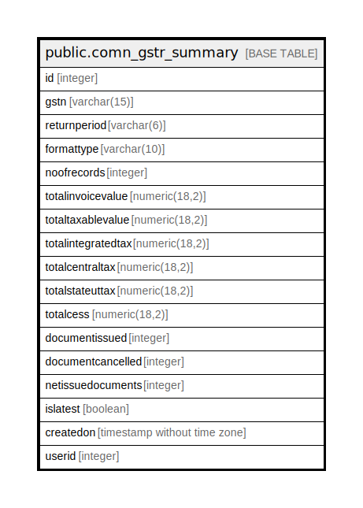

# public.comn_gstr_summary

## Description

## Columns

| Name | Type | Default | Nullable | Children | Parents | Comment |
| ---- | ---- | ------- | -------- | -------- | ------- | ------- |
| id | integer | nextval('comn_gstr_summary_id'::regclass) | false |  |  |  |
| gstn | varchar(15) |  | false |  |  |  |
| returnperiod | varchar(6) |  | false |  |  |  |
| formattype | varchar(10) |  | true |  |  |  |
| noofrecords | integer |  | true |  |  |  |
| totalinvoicevalue | numeric(18,2) |  | true |  |  |  |
| totaltaxablevalue | numeric(18,2) |  | true |  |  |  |
| totalintegratedtax | numeric(18,2) |  | true |  |  |  |
| totalcentraltax | numeric(18,2) |  | true |  |  |  |
| totalstateuttax | numeric(18,2) |  | true |  |  |  |
| totalcess | numeric(18,2) |  | true |  |  |  |
| documentissued | integer |  | true |  |  |  |
| documentcancelled | integer |  | true |  |  |  |
| netissuedocuments | integer |  | true |  |  |  |
| islatest | boolean | true | false |  |  |  |
| createdon | timestamp without time zone | now() | true |  |  |  |
| userid | integer |  | true |  |  |  |

## Relations

---

> Generated by [tbls](https://github.com/k1LoW/tbls)
