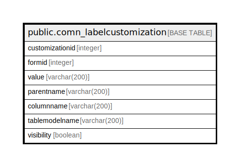

# public.comn_labelcustomization

## Description

## Columns

| Name | Type | Default | Nullable | Children | Parents | Comment |
| ---- | ---- | ------- | -------- | -------- | ------- | ------- |
| customizationid | integer | nextval('comn_labelcustomization_customizationid_seq'::regclass) | false |  |  |  |
| formid | integer |  | true |  |  |  |
| value | varchar(200) |  | true |  |  |  |
| parentname | varchar(200) |  | true |  |  |  |
| columnname | varchar(200) |  | true |  |  |  |
| tablemodelname | varchar(200) |  | true |  |  |  |
| visibility | boolean |  | true |  |  |  |

## Relations

---

> Generated by [tbls](https://github.com/k1LoW/tbls)
