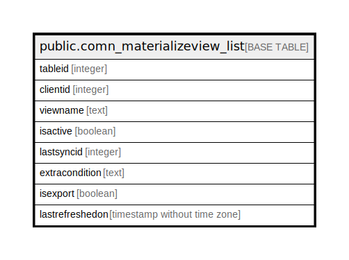

# public.comn_materializeview_list

## Description

## Columns

| Name | Type | Default | Nullable | Children | Parents | Comment |
| ---- | ---- | ------- | -------- | -------- | ------- | ------- |
| tableid | integer | nextval('comn_materializeview_list_tableid_seq'::regclass) | false |  |  |  |
| clientid | integer | 0 | true |  |  |  |
| viewname | text |  | true |  |  |  |
| isactive | boolean | false | true |  |  |  |
| lastsyncid | integer | 0 | true |  |  |  |
| extracondition | text | ''::text | true |  |  |  |
| isexport | boolean | false | true |  |  |  |
| lastrefreshedon | timestamp without time zone |  | true |  |  |  |

## Constraints

| Name | Type | Definition |
| ---- | ---- | ---------- |
| comn_materializeview_list_pkey | PRIMARY KEY | PRIMARY KEY (tableid) |

## Indexes

| Name | Definition |
| ---- | ---------- |
| comn_materializeview_list_pkey | CREATE UNIQUE INDEX comn_materializeview_list_pkey ON public.comn_materializeview_list USING btree (tableid) |

## Relations

---

> Generated by [tbls](https://github.com/k1LoW/tbls)
