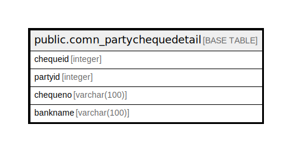

# public.comn_partychequedetail

## Description

## Columns

| Name | Type | Default | Nullable | Children | Parents | Comment |
| ---- | ---- | ------- | -------- | -------- | ------- | ------- |
| chequeid | integer | nextval('comn_partychequedetail_chequeid_seq'::regclass) | false |  |  |  |
| partyid | integer |  | true |  |  |  |
| chequeno | varchar(100) |  | true |  |  |  |
| bankname | varchar(100) |  | true |  |  |  |

## Constraints

| Name | Type | Definition |
| ---- | ---- | ---------- |
| chequemaster_pkey | PRIMARY KEY | PRIMARY KEY (chequeid) |

## Indexes

| Name | Definition |
| ---- | ---------- |
| chequemaster_pkey | CREATE UNIQUE INDEX chequemaster_pkey ON public.comn_partychequedetail USING btree (chequeid) |

## Relations

---

> Generated by [tbls](https://github.com/k1LoW/tbls)
