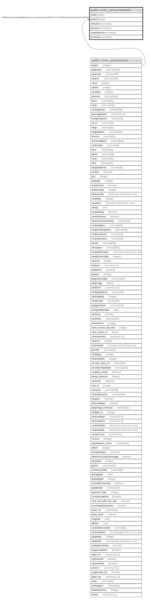

# public.comn_partysitedetail

## Description

## Columns

| Name | Type | Default | Nullable | Children | Parents | Comment |
| ---- | ---- | ------- | -------- | -------- | ------- | ------- |
| siteid | integer | nextval('comn_partysitedetail_siteid_seq'::regclass) | false |  |  |  |
| partyid | integer |  | true |  | [public.comn_partymaster](public.comn_partymaster.md) |  |
| sitename | varchar(50) |  | true |  |  |  |
| phoneno | varchar(12) |  | true |  |  |  |
| contactperson | varchar(30) |  | true |  |  |  |
| exciseno | varchar(20) |  | true |  |  |  |

## Constraints

| Name | Type | Definition |
| ---- | ---- | ---------- |
| partysitedetail_fk | FOREIGN KEY | FOREIGN KEY (partyid) REFERENCES comn_partymaster(partyid) MATCH FULL ON UPDATE CASCADE ON DELETE CASCADE |
| partysitedetail_pkey | PRIMARY KEY | PRIMARY KEY (siteid) |

## Indexes

| Name | Definition |
| ---- | ---------- |
| partysitedetail_pkey | CREATE UNIQUE INDEX partysitedetail_pkey ON public.comn_partysitedetail USING btree (siteid) |

## Relations

---

> Generated by [tbls](https://github.com/k1LoW/tbls)
